Real-Time CUDA-Vulkan Path Tracer with SVGF Denoising
================

**University of Pennsylvania, CIS 565: GPU Programming and Architecture, Project 3**

* Logan Dooley
  * [LinkedIn](https://www.linkedin.com/in/logan-dooley-a205a619a/)
* Tested on: Windows 11, 13th Gen Intel(R) Core(TM) i5-13420H (2.10 GHz), 16GB RAM, RTX 4050 Laptop

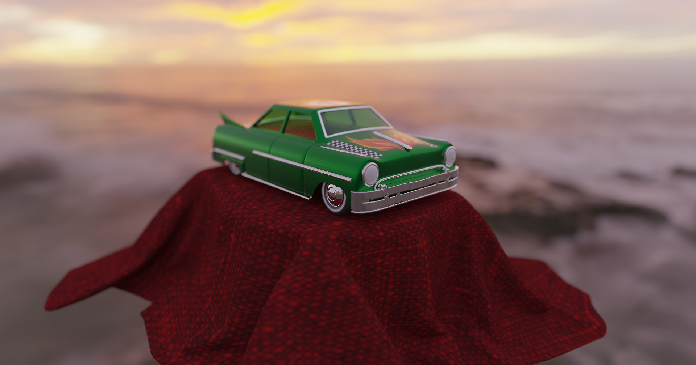

*[Toy Car](https://github.com/KhronosGroup/glTF-Sample-Assets/tree/main/Models/ToyCar) · 1920×1080 · 2048 spp · depth of field w/ lens radius 0.082 and focal distance 5.039 · Environment Map: [The Sky Is On Fire](https://polyhaven.com/a/the_sky_is_on_fire)*

**Demo video:** (TODO) link

---

## Table of Contents

* [Features Overview](#features-overview)
* [Gallery](#gallery)
* [Features](#features)
  * [Supported Materials](#supported-materials)
  * [Lighting](#lighting)
  * [Sampling Strategies](#sampling-strategies)
  * [Camera](#camera)
  * [Mesh & Scene Loading](#mesh--scene-loading)
  * [Spatial Acceleration](#spatial-acceleration)
  * [Performance Features](#performance-features)
  * [Real-Time Denoising (SVGF)](#real-time-denoising-svgf)
  * [CUDA-Vulkan Interop](#cuda-vulkan-interop)
* [Building](#building)
* [Bloopers](#bloopers)
* [Credits & References](#credits--references)

---

## Features Overview

| Category | Feature |
|---|---|
| Supported Materials | Opaque Diffuse, Perfect Mirror, Glass w/ Fresnel Reflection, Blinn-Phong Glossy-Specular, GGX PBR Metallic-Roughness with rough transmission. |
| Sampling Strategies | Next event estimation with multiple importance sampling between BRDF and NEE sampling. |
| Camera Effects | Stochastic antialiasing, depth of field. |
| Lighting | Emissive area lights (meshes and primitives), HDR environment maps with an intensity control. |
| Supported Scene Formats | glTF 2.0, OBJ, and a custom JSON format. Supports overriding materials and scene scale on import. |
| Spatial Acceleration | Two-level BVH (TLAS + per mesh BLAS), heatmap visualization. |
| Performance Features | Stream compaction, sorting rays by material, Russian roulette, GPU profiler. |
| Denoising | SVGF with separate direct/indirect filtering and albedo demodulation for textured mesh support. |
| Backend | CUDA-Vulkan interop, ImGui settings window. |

---

## Gallery

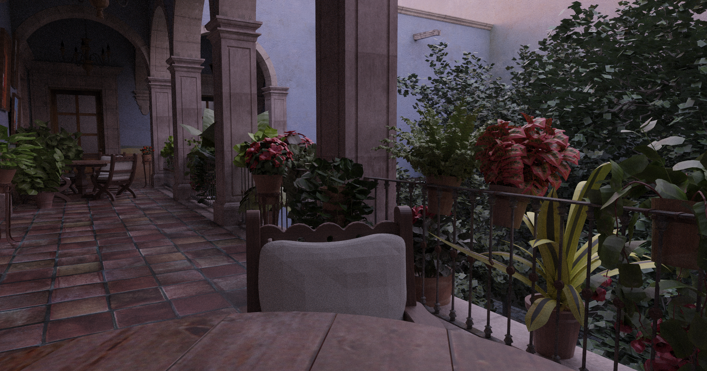

*San Miguel Scene, 512 spp, 1920 x 1080*

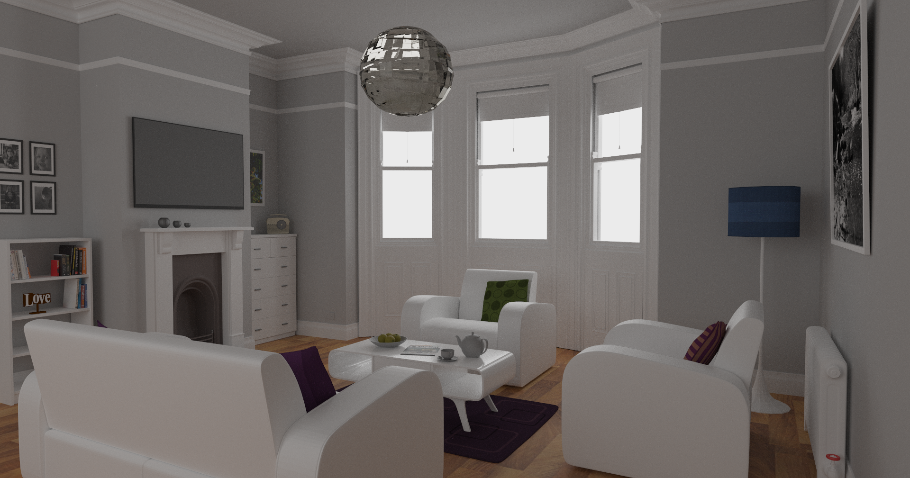

*Living Room Scene, 1024 spp, 1920 x 1080*

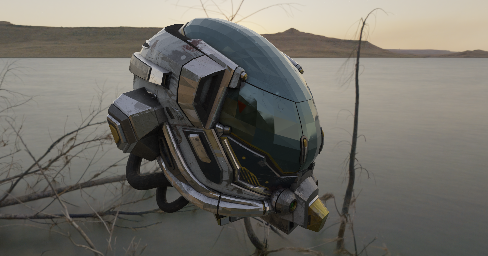

*Damaged Helmet, 1024 spp, 1920 x 1080*

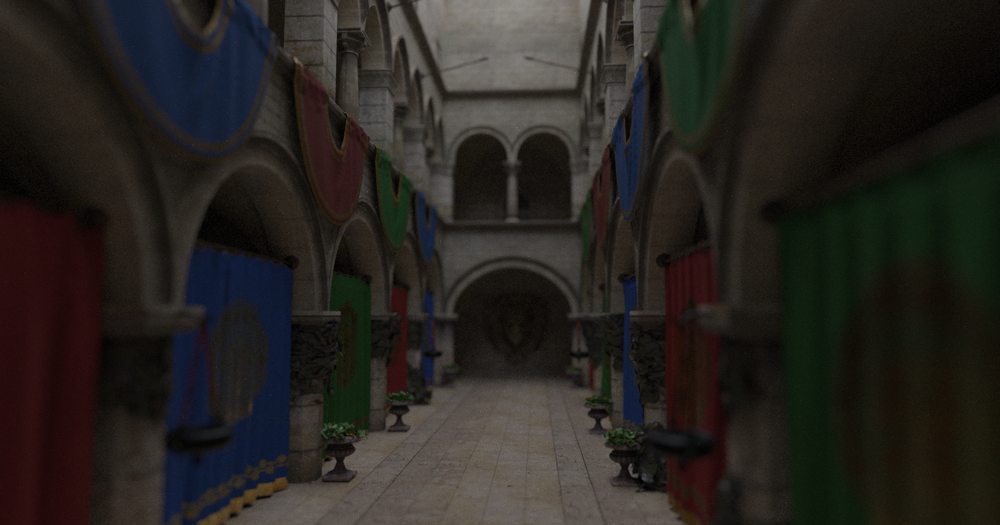

*Sponza Scene w/ DoF, 1024 spp, 1920 x 1080*

---

## Features

### Supported Materials

Each material implements 3 different operations:
* **evaluate:** returns the BSDF value given input and output directions $f(\omega_o, \omega_i)$
* **pdf:** Given $\omega_o$, returns the probability density of sampling $\omega_i$.
* **sample:** Picks a direction $\omega_i$ and returns the path throughput weight $\frac{f(\omega_o,\omega_i)\,|\cos\theta_i|}{pdf(\omega_i)}$

#### Opaque Diffuse

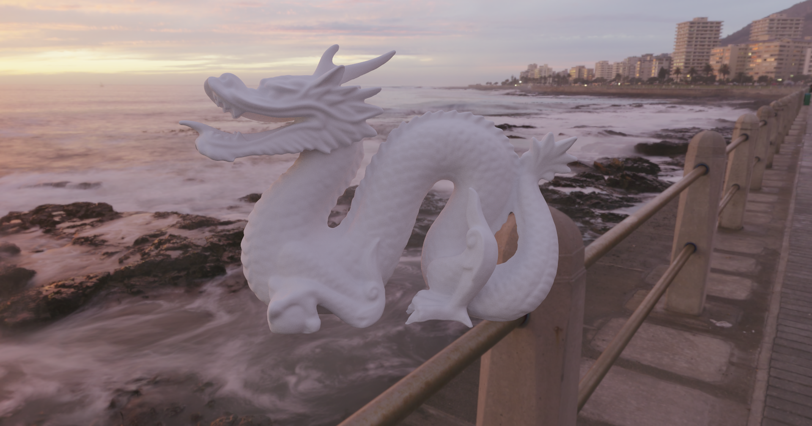

*Dragon at 1024 spp with Opaque Diffuse material, 1920×1080*

For diffuse materials, light is scattered equally in all directions, so the BSDF is $f_d = \frac{\rho}{\pi}$. To sample these materials, I use the cosine weighted hemisphere sampling from [PBR Book](https://www.pbr-book.org/4ed/Sampling_Algorithms/Sampling_Multidimensional_Functions#Cosine-WeightedHemisphereSampling).

#### Perfect Specular (Mirror)
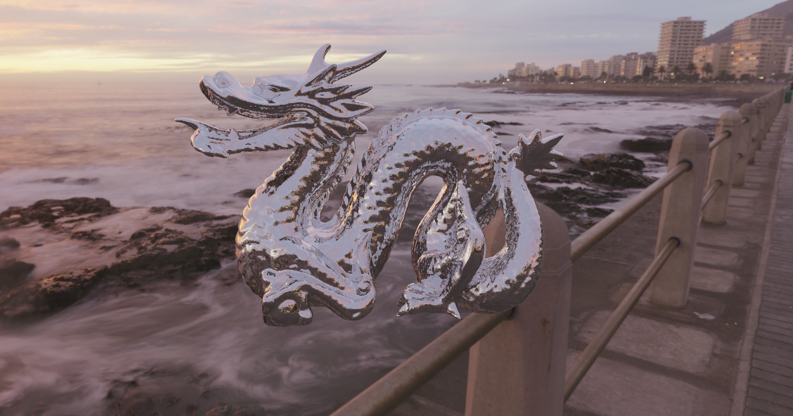

*Dragon at 1024 spp with Mirror material, 1920×1080*

Perfect specular materials reflect all the light in a single direction across the normal. The BSDF as a result has a delta distribution with pdf 0 for any direction other than exact reflection. The throughput is just the tint of the material.

#### Glass
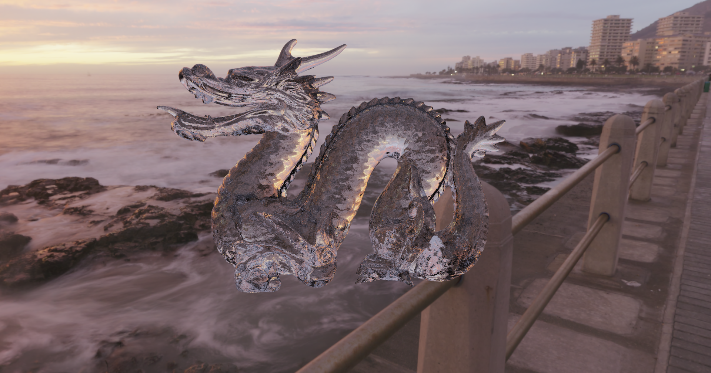

*Dragon at 128 spp with Glass material, 1.5 IOR, 1920×1080*

Glass behaves similarly to perfect specular materials, except it can both reflect and refract. The amount reflected vs. refracted is determined by the Schlick approximation of the Fresnel equations, which are: $$F(\theta) = R_0 + (1 - R_0)(1 - \cos\theta)^5, \qquad R_0 = \left(\frac{\eta_1 - \eta_2}{\eta_1 + \eta_2}\right)^2$$

Refraction follows Snell's law for the outgoing direction, which states:
$$\eta_1 \sin\theta_1 = \eta_2 \sin\theta_2$$

The probability of reflection is given by $F$, and of refraction is $1 - F$. Similar to perfect specular materials, the throughput weight is the glass tint.

Another important concept is total internal reflection, which occurs when $\sin\theta_2 > 1$. In this case, no refraction occurs, and all light is reflected.

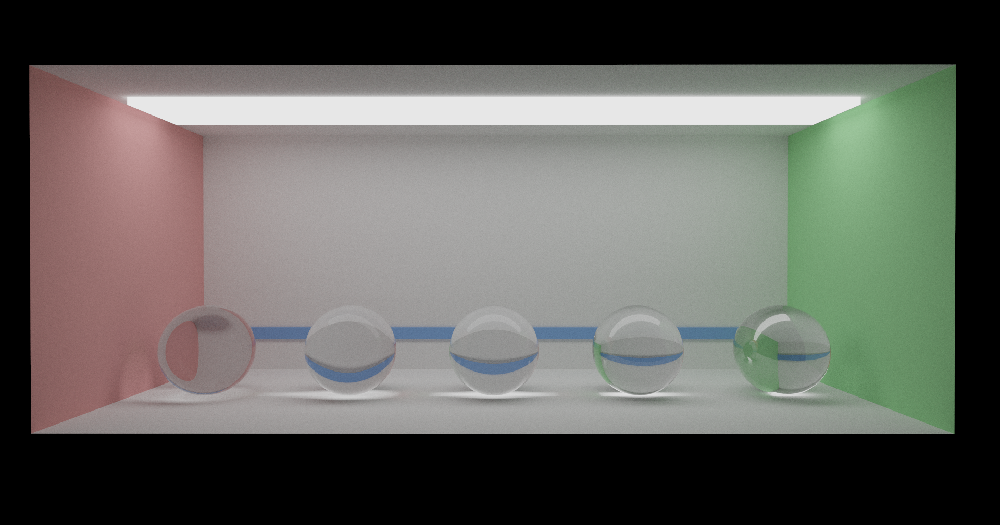

*Spheres of varying IOR from left to right: 1.1, 1.33, 1.5, 1.8, 2.42. 1024 spp, 1920 x 1080*

#### Glossy (Blinn-Phong) & PBR Metallic-Roughness

*Blinn-Phong Examples:*

| Blinn-Phong Roughness 0.1 | Blinn-Phong Roughness 0.8 | Blinn-Phong Roughness 0.9 |
|:-:|:-:|:-:|
| 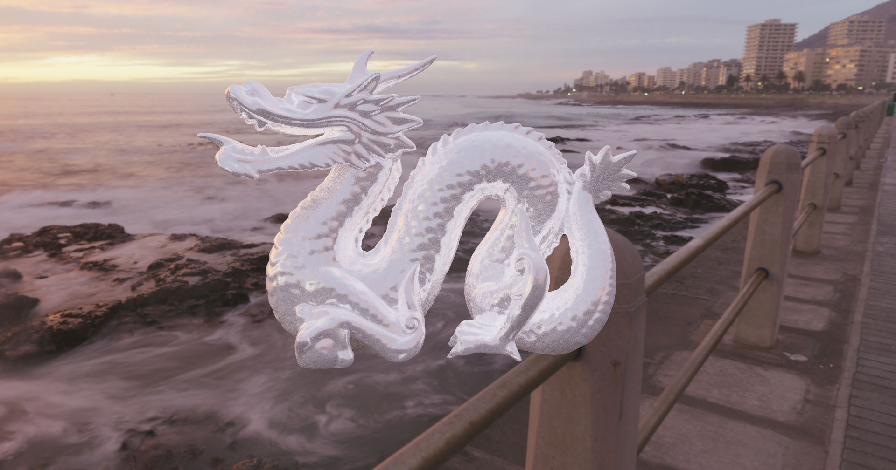 |  |  |

*Dragon at 128 spp, Blinn-Phong, 1920 x 1080*

*PBR Examples:*

|| Roughness = 0 | Roughness = 0.5 | Roughness = 1 |
|:-:|:-:|:-:|:-:|
|Metallic = 0|  |  | 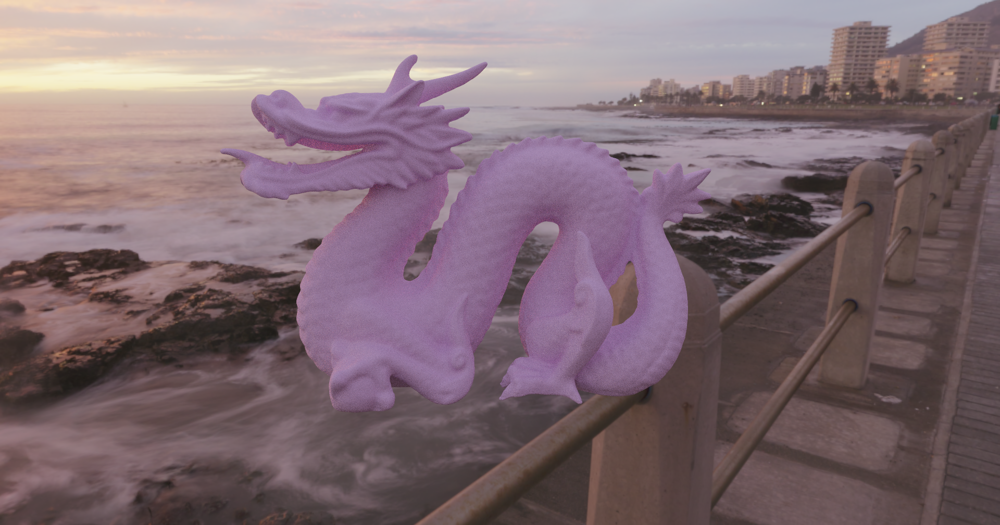 |
|Metallic = 1| 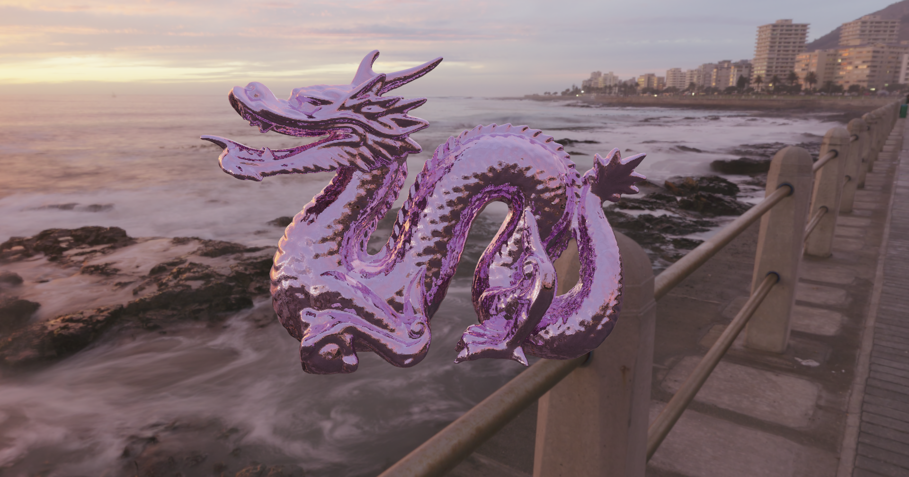 | 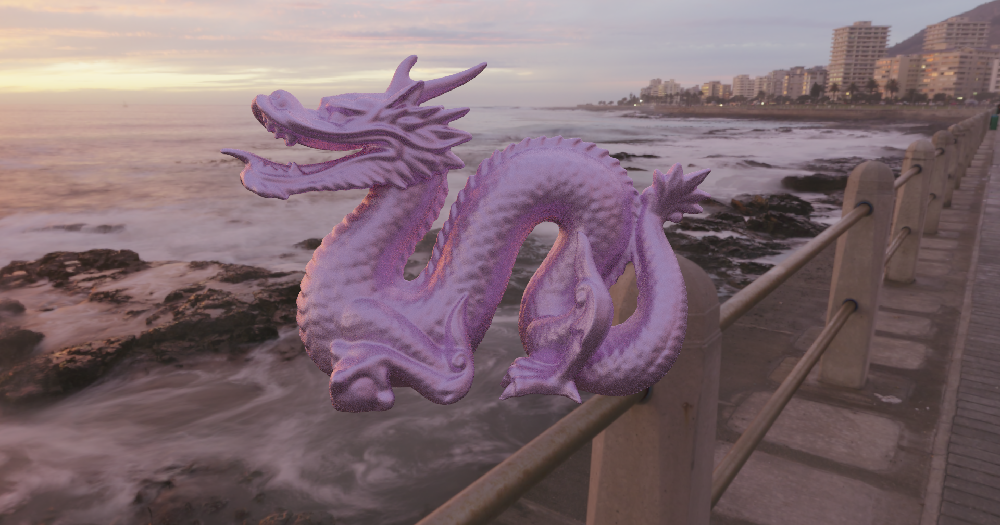 | 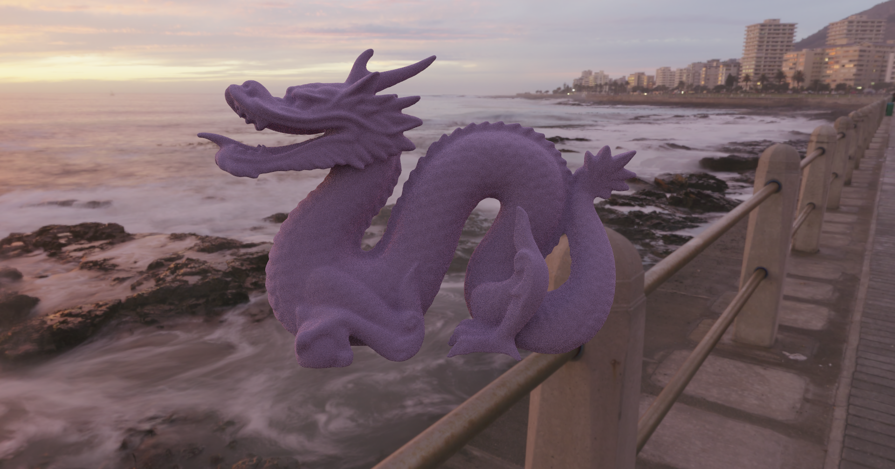 |

*Dragon at 128 spp, PBR, 1920 x 1080*

For semi-rough surfaces, I support both Blinn-Phong and PBR models, both of which use a microfacet BRDF. The BRDF I chose is the Cook-Torrance BRDF:
$$f_s(\omega_o, \omega_i) = \frac{D(\mathbf{h})\, G(\omega_o, \omega_i)\, F(\omega_o \cdot \mathbf{h})}{4\, \cos\theta_o \cos\theta_i}$$

The terms involved are:
* **D (normal distribution)**: This describes the density of microfacets facing in direction $h$. For Blinn-Phong models I use:
$$D_{blinn-phong}(\mathbf{h}) = \frac{e + 2}{2\pi}(\mathbf{n}\cdot\mathbf{h})^e$$
and for PBR materials I use the GGX distribution:
$$D_{GGX}(\mathbf{h}) = \frac{\alpha^2}{\pi\left((\mathbf{n}\cdot\mathbf{h})^2(\alpha^2 - 1) + 1\right)^2}$$

* **G (geometry term)**: This term represents how much masking there is on a microfacet with given input and output directions. For Blinn-Phong I use a V-Cavity model which uses the equation $$G_{V}(\omega_o, \omega_i) = \min\left(1,\ \frac{2(\mathbf{n}\cdot\mathbf{h})(\mathbf{n}\cdot\omega_o)}{\omega_o\cdot\mathbf{h}},\ \frac{2(\mathbf{n}\cdot\mathbf{h})(\mathbf{n}\cdot\omega_i)}{\omega_o\cdot\mathbf{h}}\right)$$
For PBR materials which already use GGX, I use the Smith equations which are: $$G = G_1(\omega_o)\,G_1(\omega_i)$$
  $$G_1(\omega) = \frac{2(\mathbf{n}\cdot\omega)}{(\mathbf{n}\cdot\omega) + \sqrt{\alpha^2 + (1 - \alpha^2)(\mathbf{n}\cdot\omega)^2}}$$

* **F (Fresnel)**: This term represents how much light is reflected vs transmitted. I use the Schlick approximation for this which given the specular reflectance $F_0$ is: $$F = F_0 + (1 - F_0)(1 - \omega_o\cdot\mathbf{h})^5$$

For sampling the BRDF, I sample from the D term (the half-vectors) which is governed by the equations:

$$\cos\theta_h^{GGX} = \sqrt{\frac{1 - \xi_1}{\xi_1(\alpha^2 - 1) + 1}}, \qquad \cos\theta_h^{blinn-phong} = \xi_1^{\frac{1}{e+1}}, \qquad \phi = 2\pi\xi_2$$

#### Rough Transmission

|| Roughness = 0 | Roughness = 0.5 | Roughness = 0.75 |
|:-:|:-:|:-:|:-:|
|Transmission = 0.5| 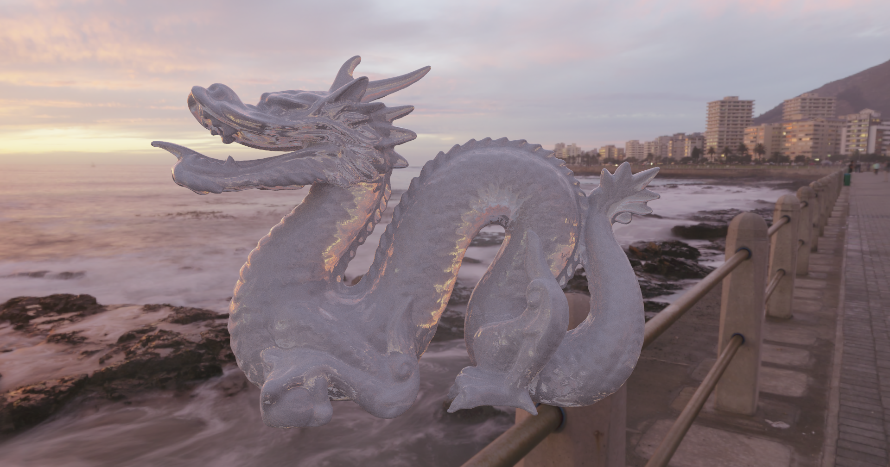 |  | |
|Transmission = 0.75| 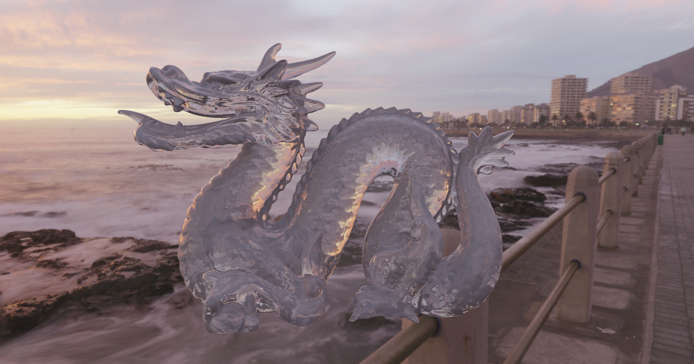 | 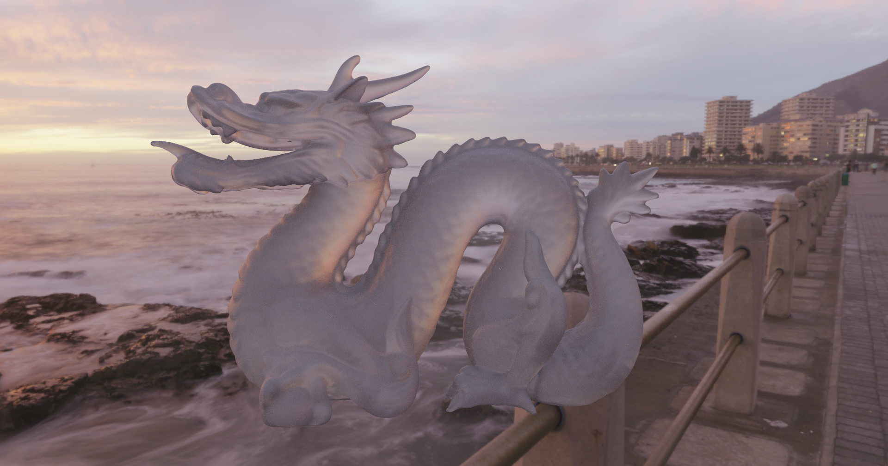 |  |
|Transmission = 1| 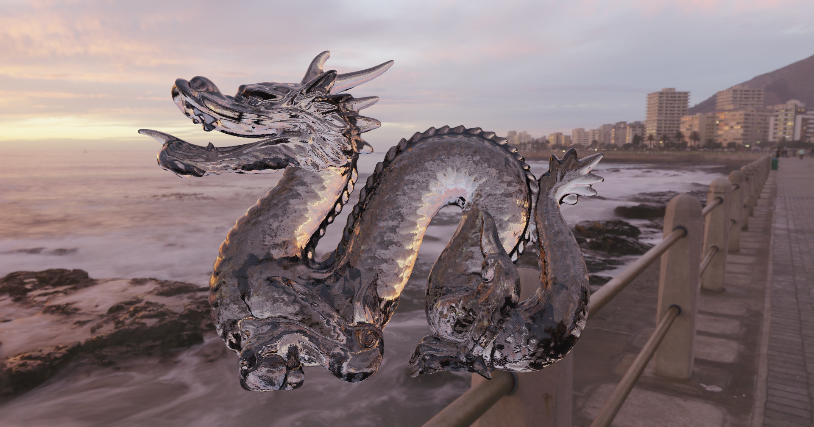 | 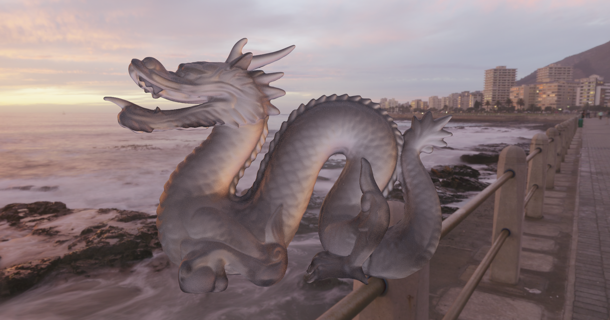 | 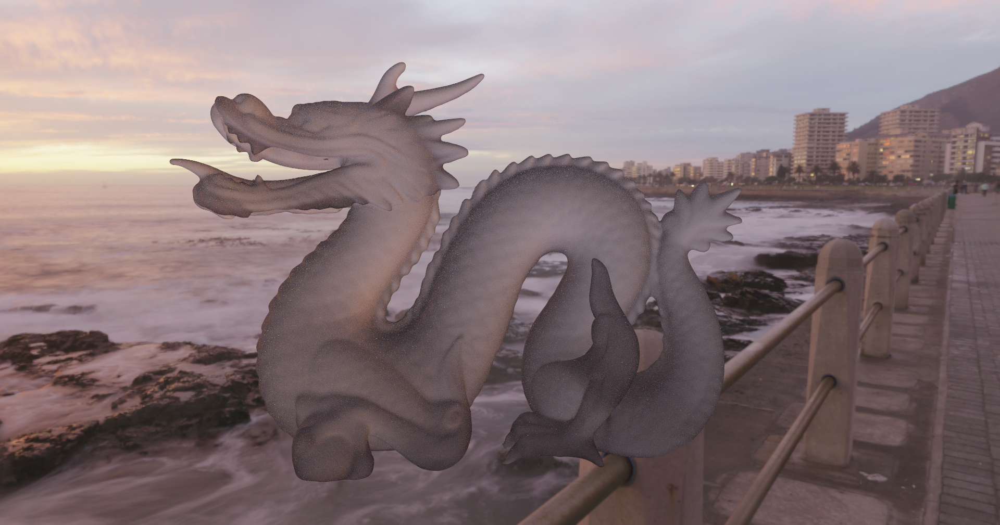 |

*Dragon at 1024 spp, PBR w/ Transmission, 1920 x 1080*

For refraction with microfacets, I use the half vector:
$$\mathbf{h}_t = -(\eta_o\,\omega_o + \eta_i\,\omega_i)$$

and the BTDF

$$f_t(\omega_o, \omega_i) = \frac{|\omega_o\cdot\mathbf{h}_t|\,|\omega_i\cdot\mathbf{h}_t|}{|\cos\theta_o|\,|\cos\theta_i|} \cdot \frac{D(\mathbf{h}_t)\, G(\omega_o,\omega_i)\,\left(1 - F(\omega_o\cdot\mathbf{h}_t)\right)}{\left(\eta_o(\omega_o\cdot\mathbf{h}_t) + \eta_i(\omega_i\cdot\mathbf{h}_t)\right)^2}$$

#### Material Analysis

##### Performance
For testing, I used the Suzanne model and rendered it up close so the number of pixels needed to be shaded was maximized. I used the material override capability of my scene loader to render the model as a single material, and render at 1920 x 1080. I then measured the runtime of the shading kernel and compared them to find the following using diffuse as a baseline:

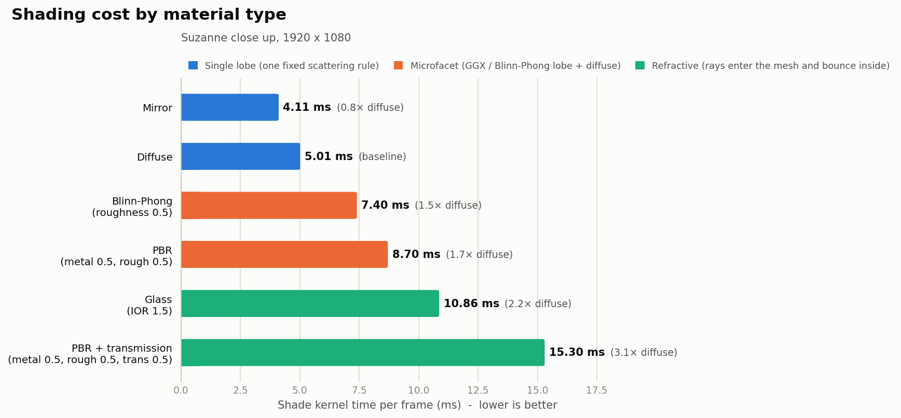

Notably, the mirror material is the least costly for shading. This is expected as the reflected direction is very simple to compute and involves no randomness, and NEE (along with its shadow ray) is skipped for delta materials. Mirror paths also tend to reflect once off the convex model and escape.

After diffuse, the microfacet reflection-only models were the next most costly. This is expected as they involve many more operations per evaluation compared to a diffuse model, calculating all the D, G, and F terms, both when sampling and again when evaluating the BRDF towards the light for NEE.

The most costly materials were the glass and transmissive PBR materials. The biggest factor is path length: the measured time is summed over every bounce, and refracted rays enter the mesh, so each path needs at least two more surface hits to get back out, and total internal reflection can trap rays inside for several more. Clear glass also absorbs almost nothing, so Russian roulette rarely terminates these paths. Warp divergence adds to this, since the choice between reflecting and refracting is random per thread, so most warps contain both branches. Transmissive PBR is the most expensive of all because it combines the long paths of glass with the per-hit microfacet math and the NEE shadow ray that glass skips.

##### GPU vs. CPU 
Every path evaluates its own BSDF independently, so this maps well to the GPU since it is very parallel in that regard. The drawback is warp divergence, both from threads in a warp evaluating different materials and from materials that randomly reflect or refract, as mentioned above, which forces those branches to execute serially.

##### Future Work
For future work, I would consider adding textured transmission, so parts of objects could be transmissive and others opaque. 

### Lighting

#### Area Lights
For this project, I support area lights for either meshes, or the simple cube and sphere primitives used in the JSON scenes. These are either hit indirectly and contribute to lighting, or can be sampled by NEE. My NEE for these is simple at the macro level: it picks an emissive object at random and samples from it. If it picks a mesh, it then picks a random triangle from the mesh and samples from it. It does not weight sampling based on triangle size, so it works best with meshes of uniform triangle size. 

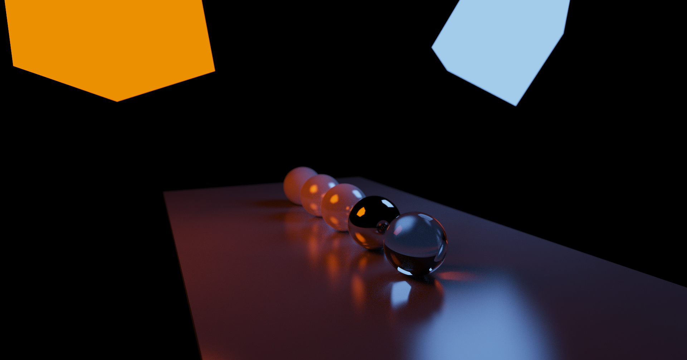

*Row of spheres of various materials lit by 2 cube primitive area lights, 1024 spp, 1920 x 1080*

#### Environment Map
Environment maps are a somewhat simple way to get some more detail and interest to scenes, and can also provide lighting to OBJ files or other scenes with no emissive objects. When a ray misses all geometry and escapes into the environment, we sample the environment map for what lighting that ray would receive. These maps are represented as an equirectangular map, so we sample based on phi and theta of an outgoing ray.

I also added an intensity slider for the environment map in my settings so the user can turn maps up or down in brightness to balance the scene better.

| [The Sky Is On Fire](https://polyhaven.com/a/the_sky_is_on_fire) | [Venice Sunset](https://polyhaven.com/a/venice_sunset) | [Penguin Museum](https://polyhaven.com/a/penguin_museum) |
|:-:|:-:|:-:|
| 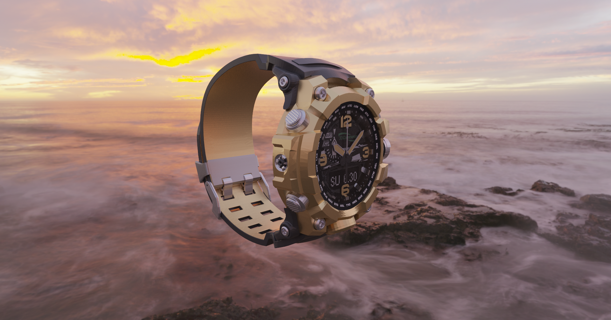 | 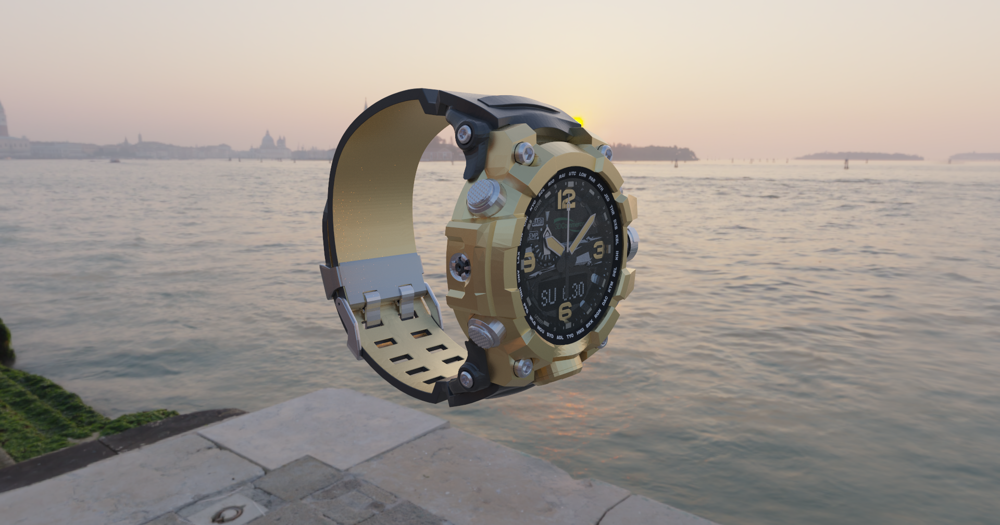 | 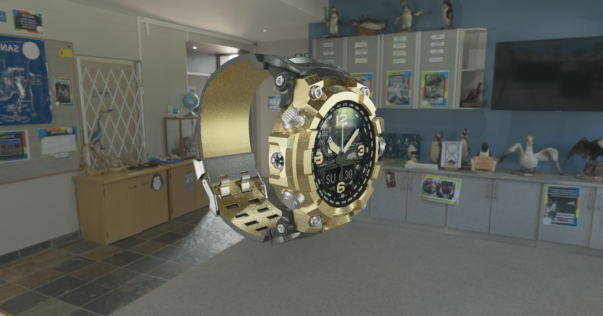 |

One notable issue is that because I do not have any method to sample emissive textures via next event estimation, I do not use next event estimation on environment maps. This causes an issue where environment maps with more variance in lighting intensity, such as small bright lights, are difficult to converge. For example in the [Ferndale Studio 04](https://polyhaven.com/a/ferndale_studio_04) HDRI, the small lights in the scene cause very slow convergence as seen below:

| 64 spp | 2048 spp | 8192 spp |
|:-:|:-:|:-:|
| 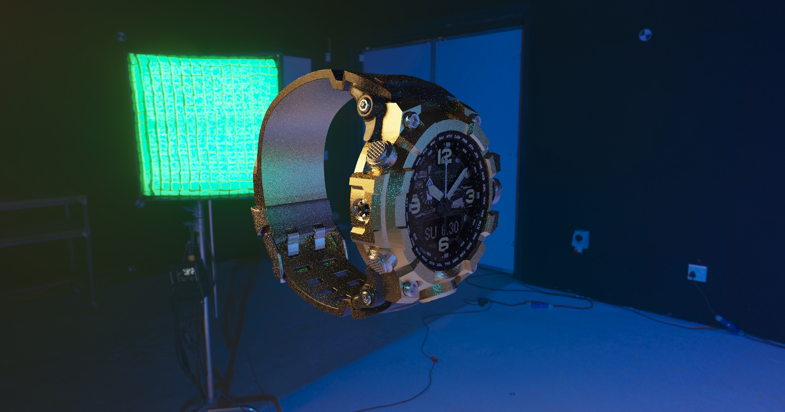 | 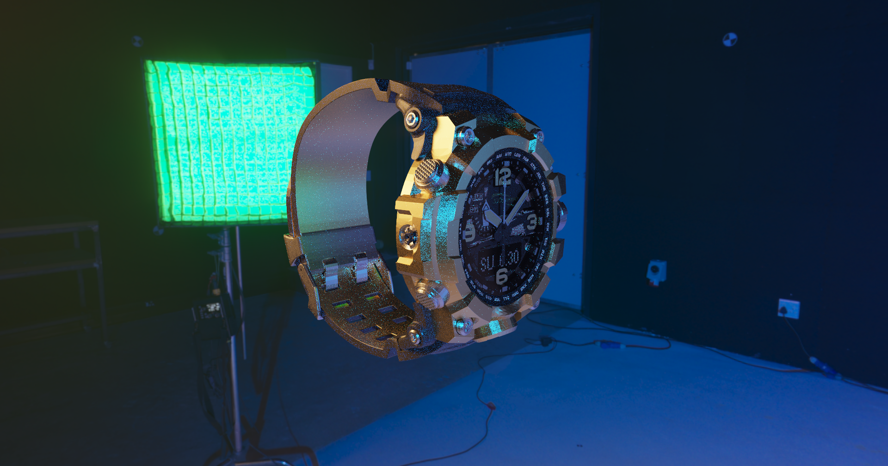 | 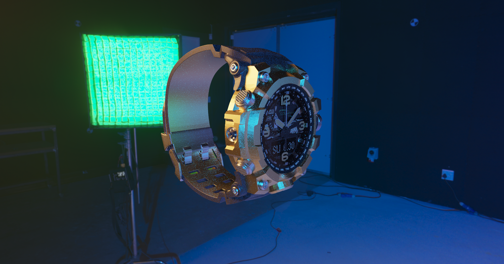 |
| 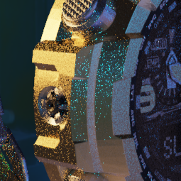 | 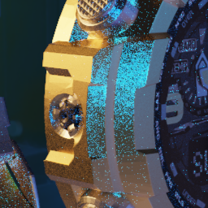 | 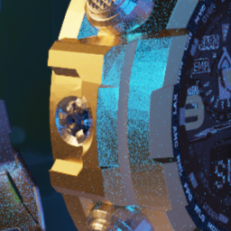 |

#### Lighting Analysis
* **Performance:** The environment lookup is just one texture fetch per escaped ray, so the cost should be negligible. For evidence, I rendered the scenes/material_showcase.json scene with and without an environment map and found the following:

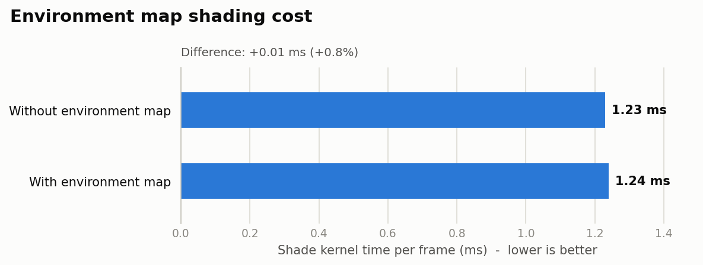

As shown, the performance difference is negligible and comes down to frame to frame variance. Area lights are regular geometry and add no cost on their own; their cost comes from next event estimation, which is analyzed in the [Sampling Analysis](#sampling-analysis) section.

* **Future Work:** For future work, it would be nice to add emissive textures and importance sampling of the environment map so both can be used with next event estimation.

### Sampling Strategies

In this section I will describe the sampling strategies I used and how I combined them with MIS for faster convergence. 

#### BRDF Sampling
Sampling the BRDF means using the material to pick where to sample from next. If a BRDF has a high density in a certain direction, then it is favorable to sample rays in that direction. For diffuse materials as mentioned previously, the light is scattered uniformly, but since there is a cosine term in the rendering equation, it is favorable to do cosine weighted hemisphere sampling rather than just sample completely randomly in the hemisphere.
For PBR and Blinn-Phong materials, I use the normal distribution to sample from, or cosine weighted hemisphere sampling depending on how strong the diffuse vs. specular components are. Glass and Mirror materials use a delta distribution so involve no randomness when picking the next direction, apart from glass picking randomly between reflection and refraction.

#### Next Event Estimation
Next event estimation instead tries connecting a surface hit with a light source, to see if there is any direct illumination possible. This can greatly increase convergence speeds, but only works with diffuse and rough materials, since glass and mirrors will have a PDF of 0 for any direction not directly reflected or refracted off the surface.

#### Multiple Importance Sampling
Multiple importance sampling (or MIS) combines both BRDF and NEE sampling and weights each sample by how likely it is its strategy produced it. It uses the power heuristic:

$$w_{NEE}(\omega_i) = \frac{p_{NEE}(\omega_i)^2}{p_{NEE}(\omega_i)^2 + p_{BRDF}(\omega_i)^2}, \qquad w_{BRDF}(\omega_i) = \frac{p_{BRDF}(\omega_i)^2}{p_{NEE}(\omega_i)^2 + p_{BRDF}(\omega_i)^2}$$

For the below test, I rendered the scenes/mis_test.json file, which is my own recreation of the Veach MIS test scene. It shows that BRDF sampling does worse for small lights reflected in rough surfaces, while next event estimation does worse for large lights reflected in glossy surfaces, and combining both with MIS gets the best of both:

| BRDF Only | NEE Only | MIS |
|:-:|:-:|:-:|
| 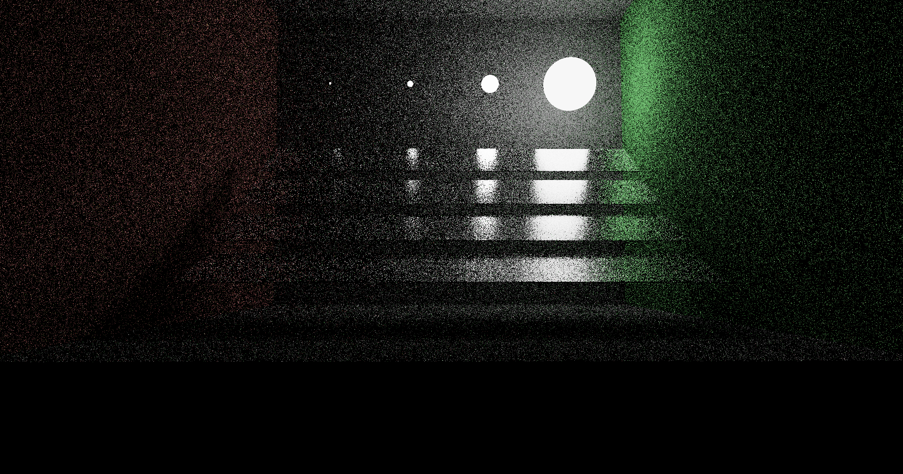 | 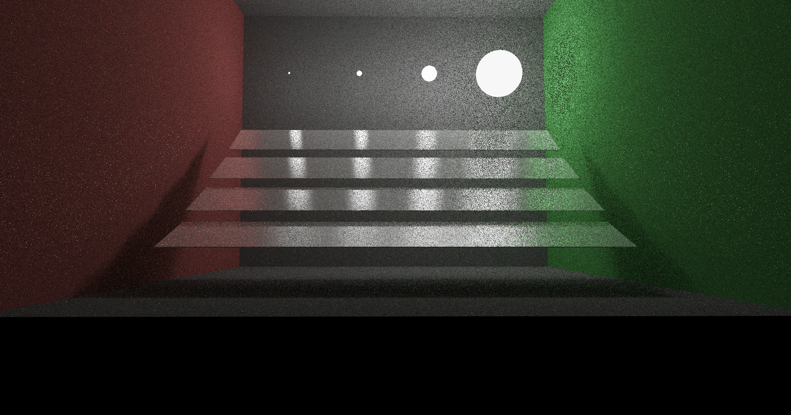 | 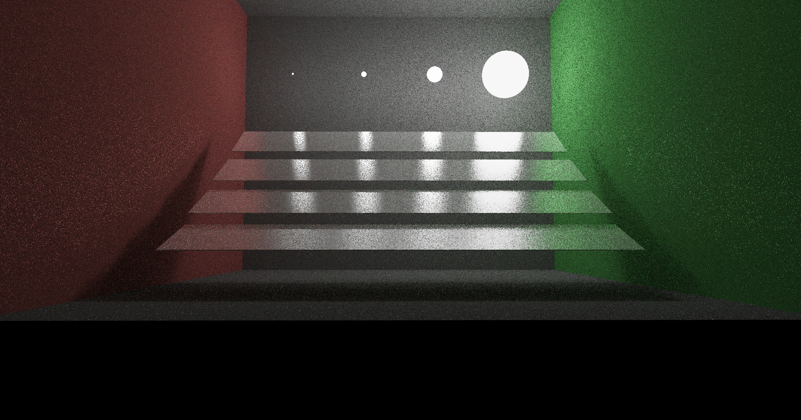 |
| 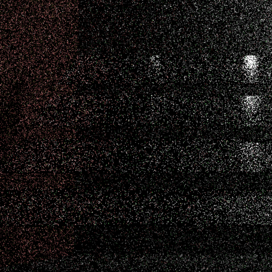 | 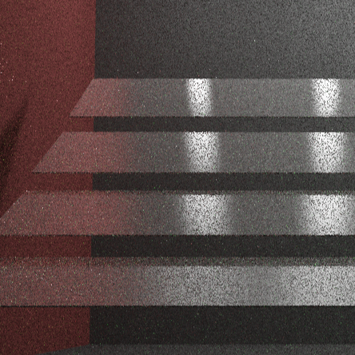 | 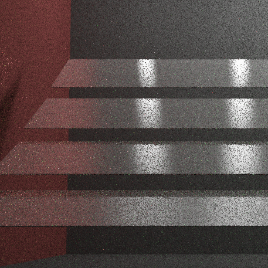 |
| 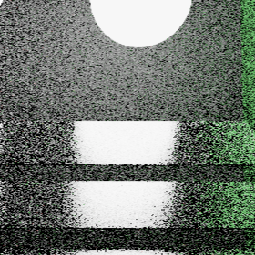 | 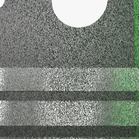 | 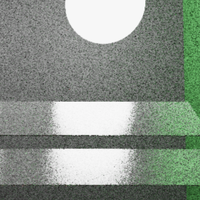 |

*scenes/mis_test.json, 16 spp, 1920 x 1080*

#### Sampling Analysis
* **Performance:** For the following test I ran my recreation of the Veach MIS test scene, scenes/mis_test.json at 1920 x 1080 with BRDF, NEE, and MIS sampling modes and found the following:

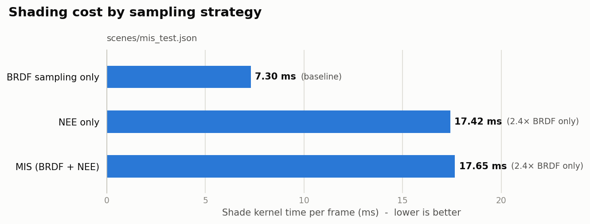

The primary reason NEE and MIS are so much more expensive is that NEE requires a visibility ray to be traversed through the scene after sampling a light. This essentially runs the intersection code within the shading kernel which is quite costly. This may look like a downgrade to use NEE and/or MIS, however the convergence of the scene is much faster, so the increased shading runtime is rewarded with fewer samples per pixel needed to reach acceptable convergence.

* **GPU vs. CPU:** The notable comparison here is that next event estimation incurs a ray scene traversal which is highly divergent between rays. A CPU core handles divergent traversal better per ray, but the GPU still wins overall from the sheer number of rays in flight.

* **Future work:** The first change I would make is adding environment map importance sampling based on the HDRI intensity. This would greatly help convergence for high variance scenes. 
The second change I would make is adding more precise sampling methods for area lights which account for relative triangle sizes. This would allow for better support of non uniformly triangulated area lights as well as better sampling when there are several separate area lights of vastly different sizes.

### Camera

#### Stochastic Antialiasing
Antialiasing is done by simply jittering the rays shot out by the camera by random amounts within the pixel they correspond to. This helps smooth out the "stair-step" effects you get with a non-antialiased renderer.

The following is an example of antialiasing disabled and enabled, showcasing on a surface with a hard diagonal edge which often shows aliasing the best. 

| AA off | AA on |
|:-:|:-:|
|  | 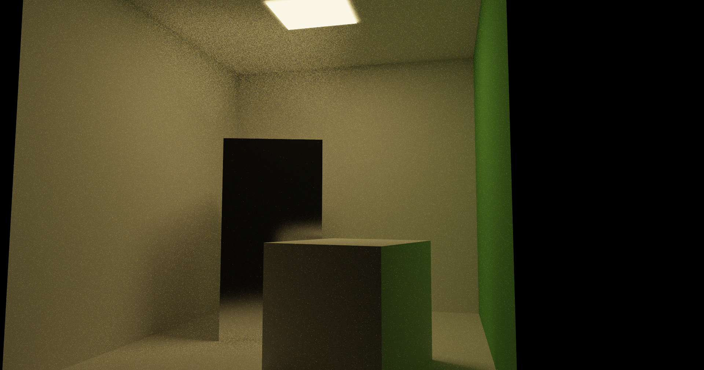 |
| 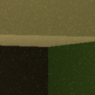 | 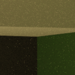 |

#### Depth of Field
The idea with depth of field is we are simulating a thin lens camera. To do this, rays will instead leave from a random point on a circular aperture and all rays through a given pixel converge on a plane at the focal distance. This ensures a crisp image at the focal distance, and then the image is blurrier as the distance from the focal plane increases.

| Focus near | Focus far |
|:-:|:-:|
| 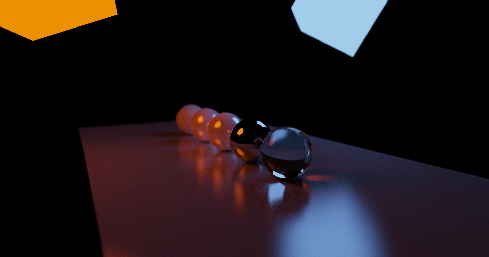 | 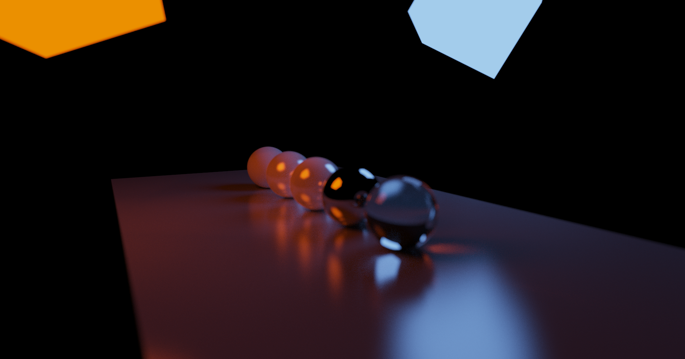 |
| *Lens radius 0.089, focal distance 9.4* | *Lens radius 0.089, focal distance 19.7* |

*Performance Impact:* This involves just a random disk sample in addition to standard pixel calculations, so has little to no impact on performance. However, it does increase the number of samples needed to converge with larger apertures. Take for example the following images at 1, 32, and 128 samples per pixel respectively:

| 1 spp | 32 spp | 128 spp |
|:-:|:-:|:-:|
| 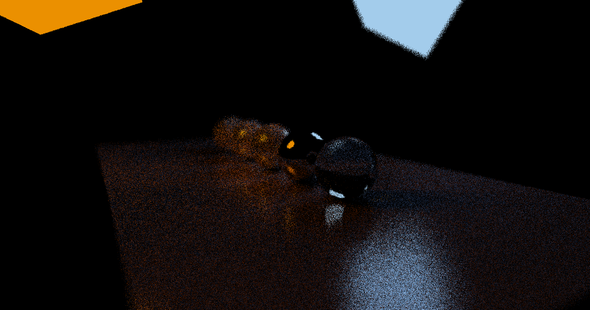 |  | 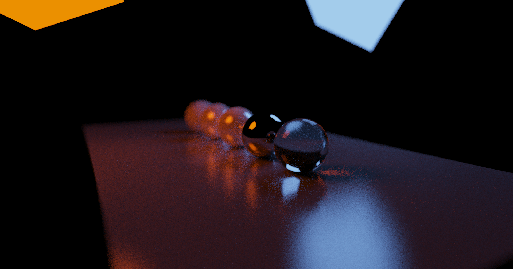 |


#### Camera Analysis
* **Performance:** Both features only involve sampling a few random numbers per pixel, so are relatively low cost. 

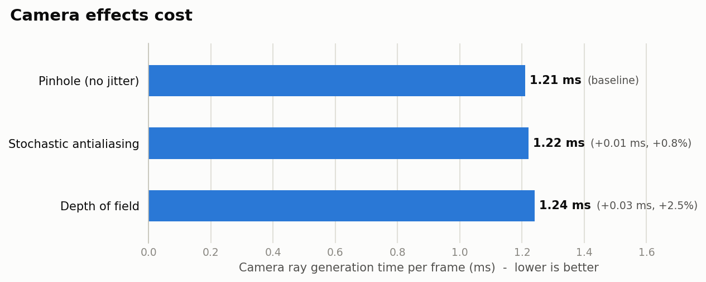

* **Future work:** I would consider using stratified sampling for pixel samples to get better convergence. I would also consider if the jitter offsets could be incorporated into the motion vectors for SVGF so it could be made compatible. Otherwise, temporal antialiasing could be a good substitute.

### Mesh & Scene Loading

#### Supported Formats
The model formats supported in this project are glTF 2.0 (including .glb binaries), OBJ, and a custom JSON format. 

For glTF files, I primarily parse out the PBR material type. However if the roughness is sufficiently high, the metallic is 0, and there is no transmission, I just use an opaque diffuse material to use simpler calculations. I support rough transmissive objects by using the KHR_materials_transmission extension to extract the transmissionFactor.

For OBJ files, I use Opaque Diffuse, Mirror, Glass, and Blinn-Phong materials depending on the illumination mode and various other parameters. I do not use PBR materials for OBJ files. 

For the custom JSON format, materials can contain the following properties:
- *RGB:* The albedo color
- *TYPE:* The type of material, can be Emitting, Diffuse, Specular, Mirror, or Glass
- *IOR:* The index of refraction. If not set, 1.5 is assumed. This is only used if the type is Glass
- *EMITTANCE:* The emissive intensity of the material. Only used if the type is Emitting.
- *ROUGHNESS:* The roughness of the material on a 0-1 scale. This is then mapped to a Blinn-Phong specular exponent between 1000 (roughness 0) and 1 (roughness 1).
- *SPECULAR_COLOR:* The color used for specular reflection. Only used for "Specular" type materials.

#### Import Settings
I additionally added 2 settings that can be applied upon importing a scene. The first is a scale factor. This is useful for loading in scenes of various scales, since some may be many orders of magnitude smaller or larger than another.

The next is a fallback material/override material setting. This can be used to prescribe the material you want to be used as a fallback if none are specified, or to override all non-emissive materials with the fallback since many OBJ files don't have built in materials.

#### Texturing
This project also supports texturing for albedo as well as using metallic-roughness maps. Albedo textures are supported for both OBJ and glTF files, but metallic-roughness maps are only supported for glTF files.

| Textured | Diffuse Override |
|:-:|:-:|
| 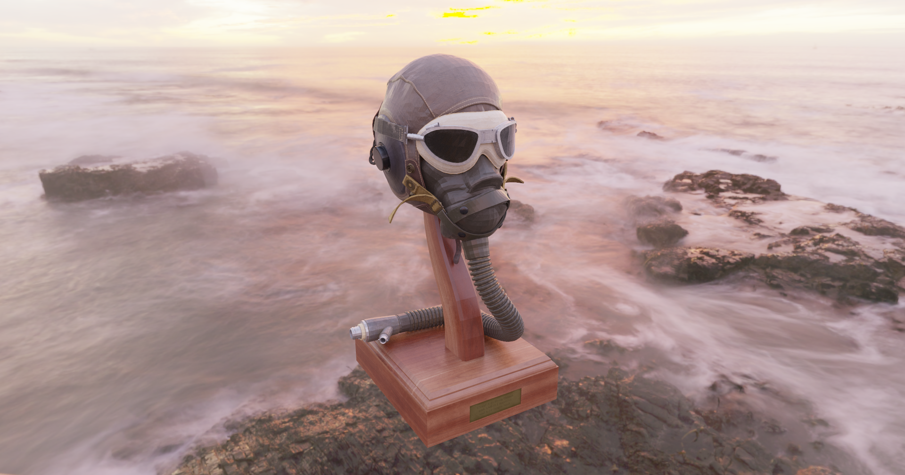 | 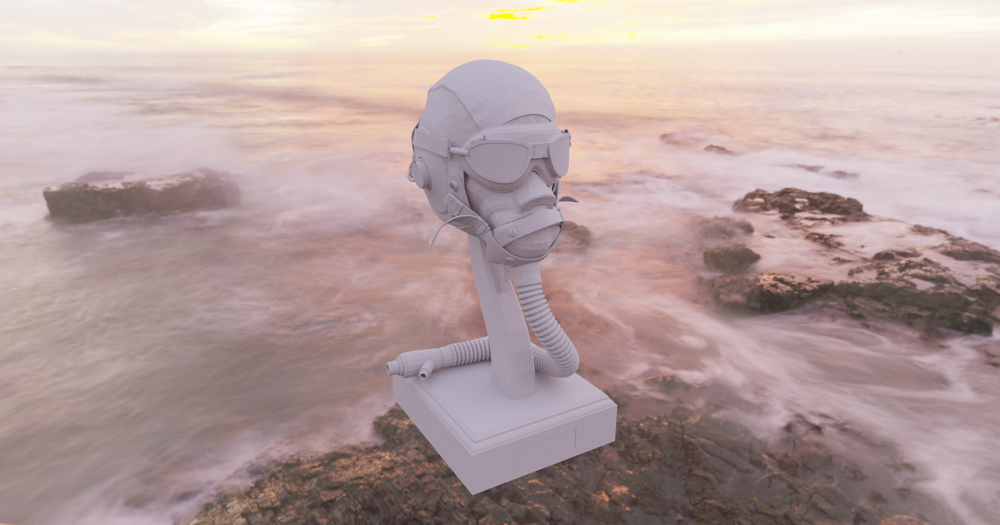 |

*Flight helmet scene rendered with and without textures, 1024 spp, 1920 x 1080*

#### Scene Loading Analysis

* **GPU vs. CPU:** Scene parsing and BVH construction are done entirely on the CPU, and only the final buffers are uploaded to the GPU.

* **Future work:** I would consider adding support for more glTF extensions, as well as possibly trying building the BVH on the GPU which could help with large scenes.

### Spatial Acceleration

Rendering a mesh without any acceleration structures requires you to iterate through every triangle in the mesh. With multiple meshes across scenes consisting of millions of triangles, this slows down intersection testing speed significantly. 

To accelerate my ray-scene intersection tests, I implemented a bounding volume hierarchy, both for the triangles within a single mesh (also known as a bottom-level acceleration structure or BLAS), as well as one for individual objects in the scene (also known as a top-level acceleration structure or TLAS).

In terms of partitioning, I used a simple midpoint split along the longest axis of a given bounding box. This may not be as efficient as using something such as a surface area heuristic, but it was relatively simple to implement.

| Render | BVH heatmap|
|:-:|:-:|
| 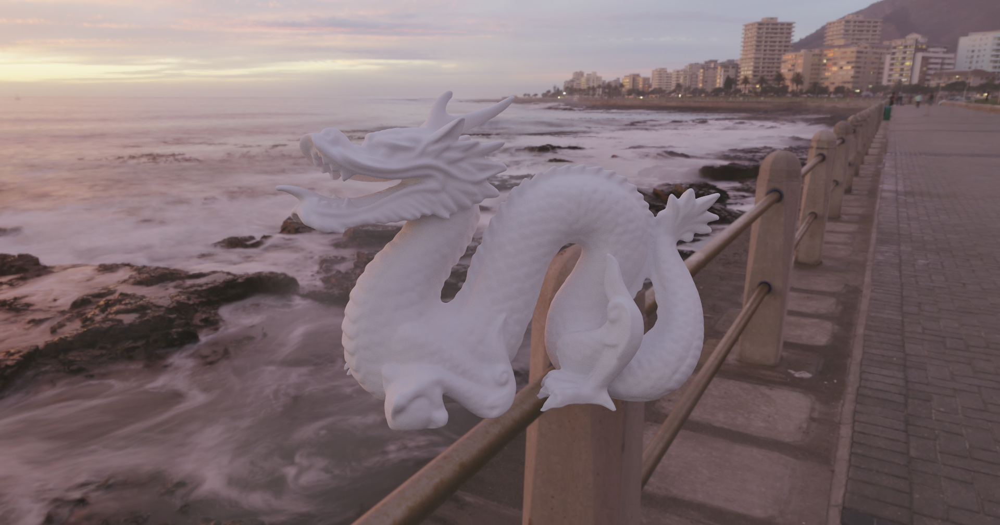 | 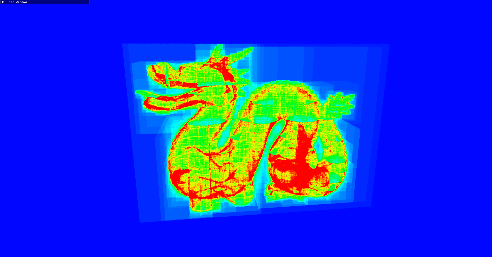 |

*Dragon Scene, 1920 x 1080, 1024 spp reference, heatmap scaled to a max of 150 traversal steps*

| Render | BVH heatmap|
|:-:|:-:|
| 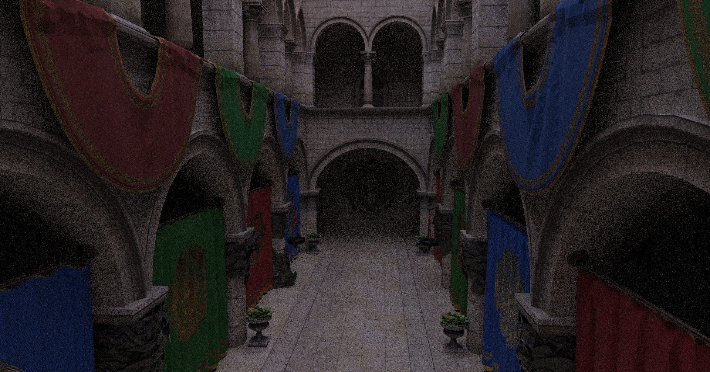 | 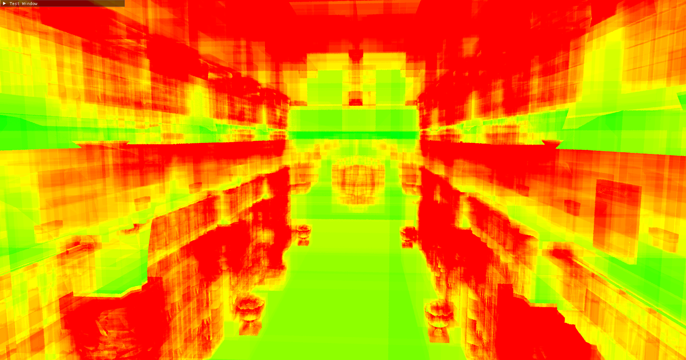 |

*Sponza Scene, 1920 x 1080, 128 spp reference, heatmap scaled to a max of 300 traversal steps*

The following tests were done at 800 x 600 resolution.

| Scene | Triangles | Brute force (ms/frame) | TLAS-Only (ms/frame) | TLAS + BLAS (ms/frame) |
|---|---|---|---|---|
| Suzanne | 3936 | 78.56 ms | 78.34 ms | 4.26 ms |
| Dragon | 871,306 | 2137.92 ms | 2094.27 ms | 13.53 ms|
| Gallery | 998,941 | N/A (couldn't run) | N/A (couldn't run) | 46.17 ms |

* **GPU vs. CPU:** Traversal is stack based and iterative, and threads in a warp diverge when rays take different paths through the tree. A CPU would traverse the same tree per ray without the issue of warp divergence, but wouldn't be able to run as many rays in parallel.

* **Future work:** The next improvement I would make is trying out the surface area heuristic for building the BVH rather than the midpoint split I am currently using. This could potentially make BVH traversal in scenes like Sponza more efficient.

### Performance Features

#### Stream Compaction
If we consider a path tracer which traces one sample per pixel, and iterates over N bounces, many of these paths at bounces 1, 2, 3 etc. will miss the geometry and hence terminate. This can be a potential performance dip since we waste time processing these terminated rays just to early-out on each iteration.

Stream compaction will move the currently active rays to the front of a buffer such that on the next pass, we can launch kernels just for the remaining active rays and avoid wasting time processing terminated rays.

The performance benefit depends on the scene and how many rays will escape vs. intersect geometry. In the examples below, I rendered the Dragon scene both up close and far away to evaluate the effect of stream compaction on performance and found opposing effects for each:

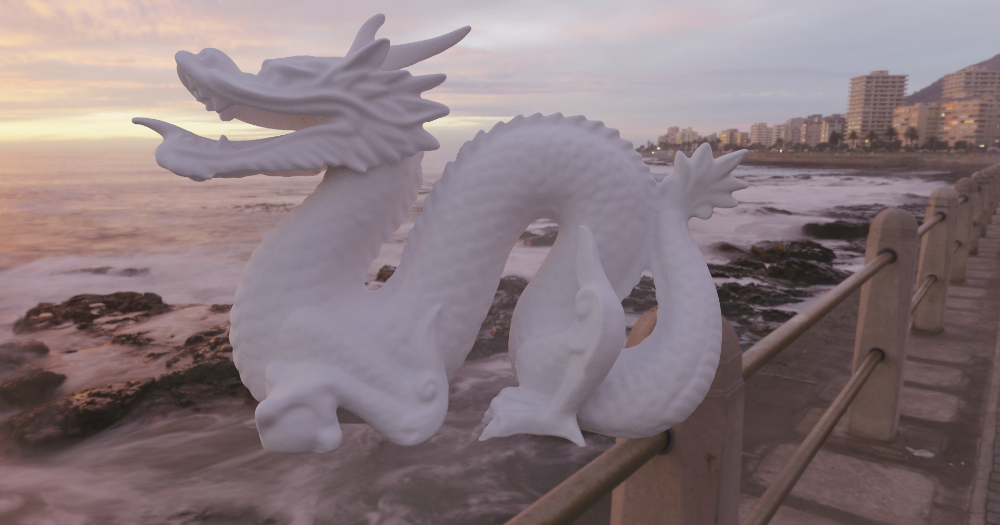

*Dragon model rendered up close, 1920 x 1080*


*Dragon model rendered far away, 1920 x 1080*

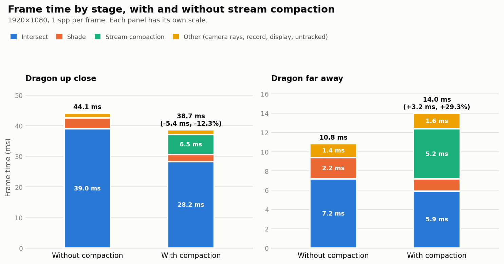

* **Performance:** In general, stream compaction roughly costs a constant amount of time regardless of the setup of the scene. This intuitively makes sense as we are compacting a buffer of N pixels no matter what the scene has within it. However, for the dragon up close, it is seen that stream compaction is a net benefit whereas from far away, it is a net detriment. This is likely because when up close, intersection tests dominate the runtime, so compaction is helpful to these by a factor larger than the cost of the compaction itself. However, for the far away dragon, many rays just early out anyways, which isn't too costly especially in this scene where neighboring rays are likely to hit or miss together, so less divergence happens in that regard. Because of that, the added cost of the compaction itself does not outweigh the minor benefit we get for removing the terminated rays from being launched, so the performance actually decreases.

#### Material Sorting
One other potential strategy to improve performance is by sorting rays by material type prior to executing each shading kernel. This is because each material type uses different techniques for evaluation, sampling, and finding the pdf as mentioned previously, and on GPUs this causes a phenomenon known as warp divergence. If threads in the same warp take different paths in an if statement, the if statement will have to be processed serially rather than in parallel. By sorting rays by material type, we reduce the number of warps with differing materials, which can lower warp divergence.

However, with large ray structures, this sorting process can be quite significant in terms of frame time, and for this project actually proved to worsen the overall performance. This is likely due to the relatively large size of PathState structs that need to be sorted, requiring a higher memory throughput to complete the sort.

For a 1920 x 1080 render of the material_showcase.json and Sponza scenes, I saw the following results with and without sorting by material enabled:

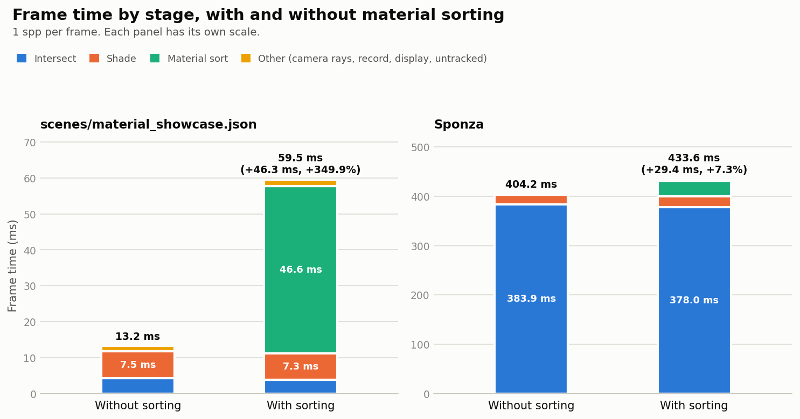

Reference images of the view angles for the material_showcase.json and Sponza scene are below:

| material_showcase.json | Sponza |
|:-:|:-:|
| 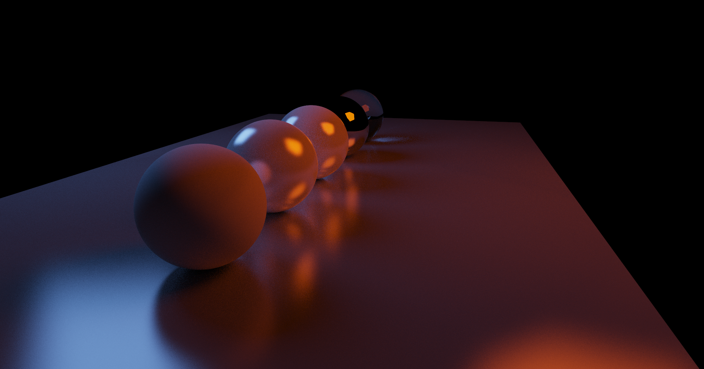 | 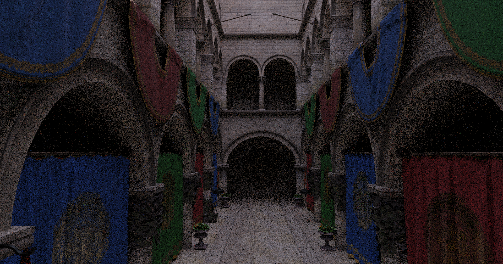 |

* **Future work:** I think a more effective method to attempt here would be wavefront path tracing, where material sorting is implicit via binning. This would possibly reduce the heavy cost of moving memory during this sorting step which makes it not worth it.

#### Russian Roulette
Another performance optimization could be terminating paths when they have very little throughput remaining. However if we do this in a cut off manner, it will bias the final result. The technique used to do this optimization is called Russian roulette and involves setting a "survival probability" on a path at the end of each shading execution which is higher for paths with high remaining throughput and lower for paths with lower remaining throughput. We then pick a random number to evaluate if a path should terminate based on that chance. Those which survive have their throughput divided by their survival probability to account for the random path termination.

In the following test, I rendered the Sponza scene at 800 x 600 resolution with a max bounce count of 12 and measured the number of active paths after each bounce with Russian roulette turned on or off. Paths must complete 2 bounces before Russian roulette begins, and setting the minimum survival to 1 effectively disables Russian roulette:

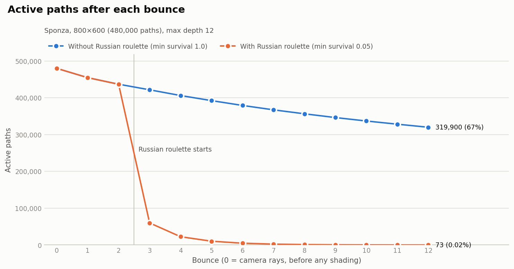

Without Russian roulette, the number of active paths slowly and steadily decreases over time, and 67% of paths are still alive by bounce 12. Since the sponza scene is pretty closed, a lot of these rays are likely bouncing around the enclosed space. With russiasn roulette, once russian roulette starts, a large portion of the rays are immediately terminated. This is likely because their transmission is fairly low after 3 bounces, so russian roulette would favor their termination.

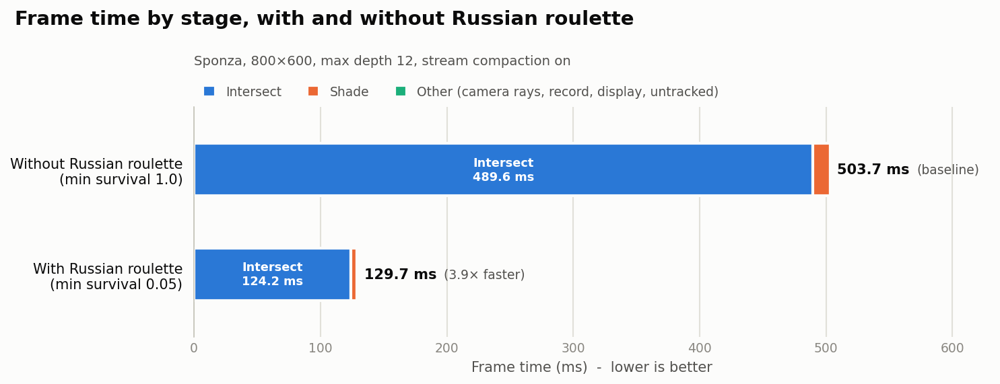

Since less paths survive to later bounces, the intersection and shading stages become cheaper as they have less rays to process over the course of a frame. Intersection drops from 489.6 ms to 124.2 ms and shading from 13.9 ms to 4.9 ms, making the whole frame about 3.9x faster. Additionally, without Russian roulette,  stream compaction has almost nothing to remove since many of the rays in the sponza scene stay active just bouncing around with little throughput.

At 64 spp, the sponza scene looks nearly identical with and without russian roulette, likely because russian roulette divides the radiance by the survival chance of the ray to avoid bias.

| w/o Russian Roulette | w/ Russian Roulette |
|:-:|:-:|
|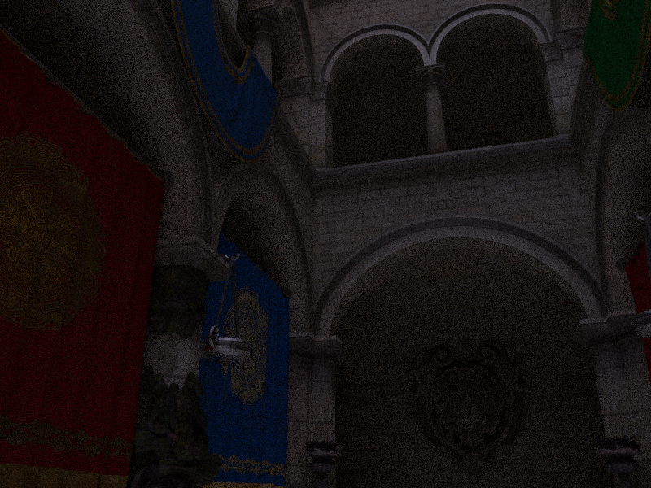|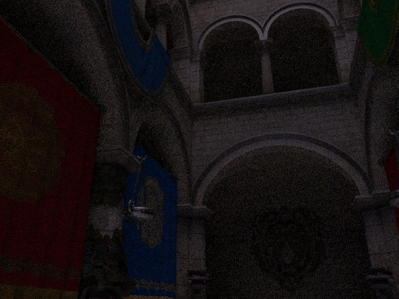|

*Sponza w/ and w/o Russian roulette path termination, 64 spp, 800 x 600*

#### GPU Profiler
To better visualize and gather runtime data, I implemented a simple GPU stage-based profiler that could be used to accumulate the amount of time per stage to display in the ImGui interface.

The profiler is located in gpuProfiler.h/cpp. ScopedStage represents a single stage that uses RAII patterns to start and stop timers when the object goes out of scope. A stage can be created by calling the scope method on the GpuProfiler. This will create a scoped stage with the input name. 

To handle cudaEvents, I created a pool of them which could be acquired as needed. This pool is reset at the start of a frame so events can be re-used for sequential frames. At the end of the frame, I accumulate the milliseconds for all stages and also smooth them out using an exponential moving average so the numbers don't jump around too much. 

The results are then drawn using an ImGui table, showing each stage and its time in ms, as well as an extra row for the untracked time for the frame that wasn't profiled by a scoped stage.

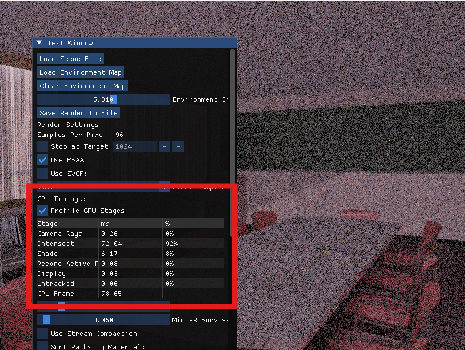

### Real-Time Denoising (SVGF)
One of the main features of this project was implementing [Spatiotemporal Variance-Guided Filtering](https://research.nvidia.com/labs/rtr/publication/schied2017spatiotemporal/). This is a real-time method that takes 1 sample per pixel path traced outputs and accumulates and denoises them over time using a wavelet filter.

The pipeline is as follows:
1. Retrieve G Buffers for Direct and Indirect Illumination, Normals, Depth, Albedo, and Geometry ID, and compute motion vectors per pixel.
2. Demodulate albedo from illumination.
3. Run temporal accumulation based on motion vectors.
4. Estimate variance temporally or spatially.
5. Iteratively run an Atrous filter over the image, using edge stopping functions to limit filter ranges.

#### G Buffer Retrieval
This algorithm requires access to several G-Buffers. Some implementations use a rasterizer to capture these, but in my implementation I just cache the G-Buffers after the first iteration of path tracing. I pack my G-Buffers as follows:
- Normal (XYZ) + Depth (W)
- Albedo (XYZ)
- Geometry ID (X)
- Motion Vectors (XY)
- Direct Illumination (XYZ), captured from final 1 SPP output 
- Indirect Illumination (XYZ), captured from final 1 SPP output 

##### Normals
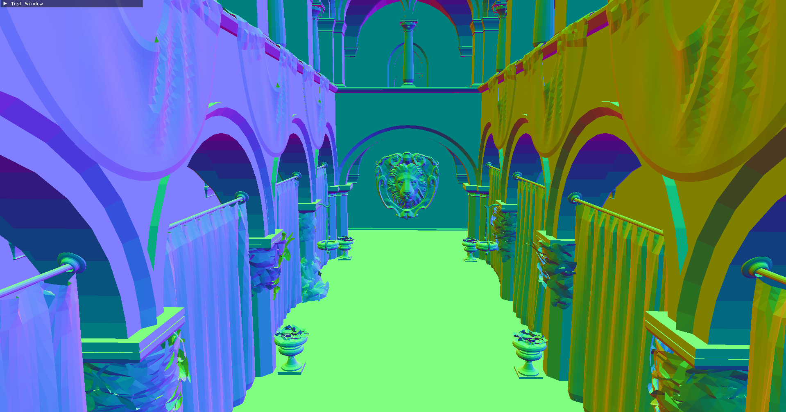

*Sponza Scene Normals Buffer, 1920 x 1080*

##### Albedo
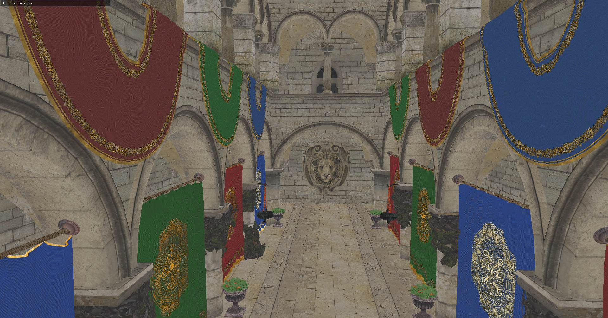

*Sponza Scene Albedo Buffer, 1920 x 1080*

##### Direct Illumination
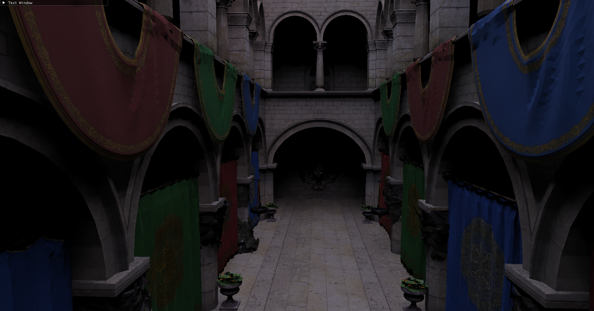

*Sponza Scene Direct Illumination Buffer, 1920 x 1080*

##### Indirect Illumination
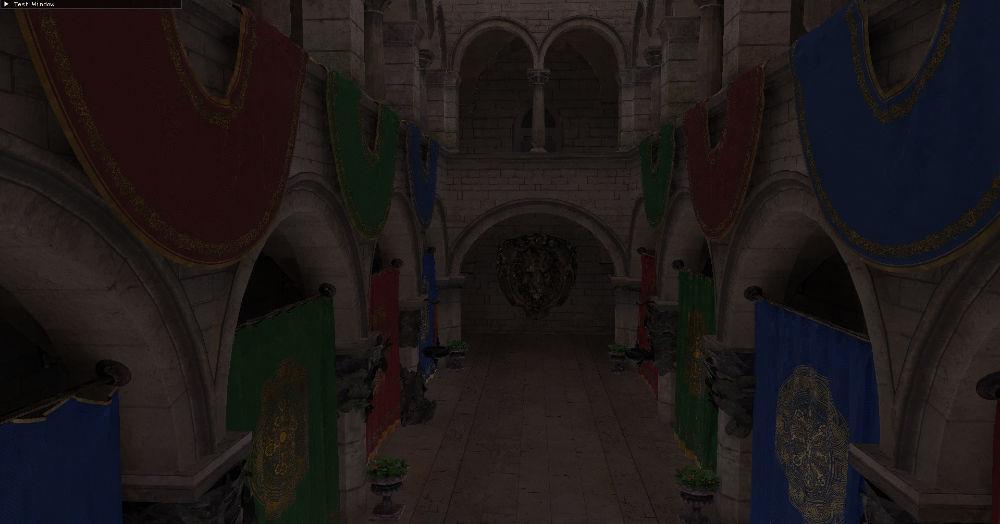

*Sponza Scene Indirect Illumination Buffer, 1920 x 1080*

##### History Length
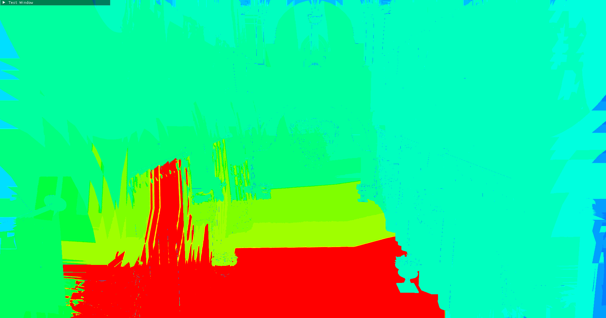

*Sponza Scene History Length Buffer (after moving the camera), 1920 x 1080*

#### Albedo Demodulation
The next step of the algorithm is to demodulate albedo so that textured meshes aren't incorrectly detected as being high variance regions that need to be filtered. This is done in a single kernel which divides the direct and indirect illumination channels by the albedo of each pixel, to get a more normalized value for illumination decoupled from the primary-hit albedo.

From this stage onwards, the algorithm is split into two paths, one for operating on the direct, and one for operating on the indirect illumination.

#### Temporal Accumulation
Once albedo has been demodulated, we use motion vectors to reproject pixels to where they had been in the previous frame. We use a 2x2 bilinear filter to sample the history, and check that the depth and normal are not significantly different from those in the previous frame, and that the geometry ID matches, so as to not mistakenly sample incorrect surfaces.

This operation updates a history buffer which contains the number of samples $h$ each pixel has been able to historically accumulate. If remapping failed, the history is set back to 1 sample. The history length is capped at 32. Samples are accumulated using an exponential moving average, governed by:
$$C_i = C_{i - 1} (1 - \alpha) + C_{1 spp} \alpha, \qquad \alpha = \max\left(\frac{1}{h},\ \alpha_{min}\right)$$

Using $\frac{1}{h}$ for the first few frames makes them a plain average, so a pixel with new history isn't dominated by its first noisy sample. Once $\frac{1}{h}$ drops below the Color Alpha setting $\alpha_{min}$, the blend becomes a regular exponential moving average.

This means higher alpha values mean new pixels will more rapidly take over and history is less preserved. This can lead to more "firefly"-like effects where high variance in the 1 spp images shows through to the SVGF filtered ones, but setting $\alpha$ too low leads to images taking longer to "un-smear" after moving the camera.

For details on motion vector calculations, I do not currently support moving geometry, so the camera matrix $M$ is all that controls the motion vectors currently. First, the world space position of the pixel is projected using the camera matrices in the following equations:
$$
c_i = M_i \begin{bmatrix} x \\ 1 \end{bmatrix}, \qquad
c_{i-1} = M_{i-1} \begin{bmatrix} x \\ 1 \end{bmatrix}
$$

I then divide the reprojected pixels by their w value to get normalized device coordinates and remap them to find their corresponding pixel coordinate using the formula:

$$
p(c) = \left( \frac{c_x / c_w + 1}{2}\, W,\ \ \frac{1 - c_y / c_w}{2}\, H \right)
$$

The motion vector is then just the pixel space offset of the vector between the previous and current pixel space coordinates. I use a system of motion vectors pointing back towards the previous position to make resampling simpler. 

$$
v = p(c_{i-1}) - p(c_i)
$$

##### Motion Vectors
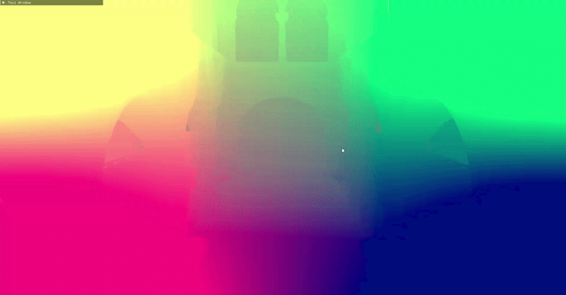

*Sponza Scene Motion Vectors during camera movement, 1920 x 1080*

#### Variance Estimation
The next step is to estimate the variance of each pixel. If there is sufficient history ($h \geq 4$) then we can calculate the variance directly from the moments. This uses the equation 
$$Var(X) = E[X^2] - (E[X])^2$$

If there is insufficient history, we instead run a 7x7 bilateral filter with weights:
$$W = W_{Normal} * W_{Depth} * W_{History}$$
Governed by:
$$W_{Normal} = (max(0, n_{center} \cdot n_{neighbor}))^{128}$$
This weights neighbors with similar normals favorably, using a similar equation to the edge stopping weights but with an exponent I found worked best.

$$W_{Depth} = exp(-\frac{|d_{center} - d_{neighbor}|}{d_{center} * 0.1 + \epsilon})$$
This is a simpler relative difference test, and in my history rejection test I check if the relative difference is less than 0.1 hence the division by 0.1 here to account for that allowed error.

$$W_{history} = max(1, h_{neighbor})$$
This weights neighbors with more history more heavily since their temporal variance is likely lower.

##### Direct Variance
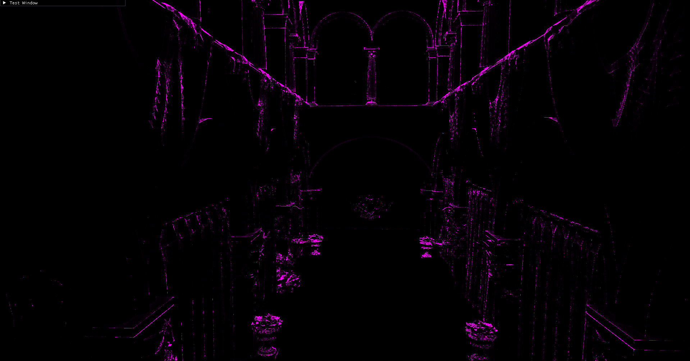

*Sponza Scene Direct Illumination Variance, 1920 x 1080*

##### Indirect Variance
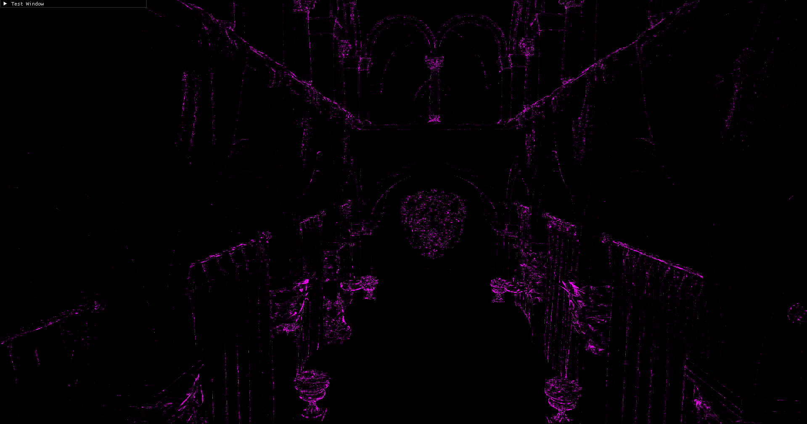

*Sponza Scene Indirect Illumination Variance, 1920 x 1080*

#### Atrous Filtering
The final step before presentation is to run several iterations of an atrous wavelet filter over the image. This is done as a 5x5 cross-bilateral filter between the center pixel $p$ and the neighbors $q$ governed by the following equations for color and then variance:

$$\hat{c}_{i + 1}(p) = \frac{\sum_{q \in \Omega} h(q) \cdot w(p, q) \cdot \hat{c}_{i}(q)}{\sum_{q \in \Omega} h(q) \cdot w(p, q)}$$

$$Var(\hat{c}_{i+1}(p)) = \frac{\sum_{q \in \Omega} h(q)^2 \cdot w(p, q)^2 \cdot Var(\hat{c}_{i}(q))}{(\sum_{q \in \Omega} h(q) \cdot w(p, q))^2}$$

Where
$$h = (\frac{1}{16}, \frac{1}{4}, \frac{3}{8}, \frac{1}{4}, \frac{1}{16})$$

The key function here is actually $w(p, q)$, which is the "edge-stopping" function. It acts as a multiplier for the kernel weights, taking into account differences in depth, normal, and luminance:

$$w(p, q) = \exp\left(-\frac{|z(p) - z(q)|}{\sigma_z\,|\nabla z(p) \cdot (p - q)| + \epsilon} - \frac{|l(p) - l(q)|}{\sigma_l\,\sqrt{g_{3\times3}(Var(l(p)))} + \epsilon}\right) \cdot \max\left(0,\ n(p) \cdot n(q)\right)^{\sigma_n}$$

The depth term allows larger depth differences along the screen space depth gradient, so slanted surfaces aren't treated as edges. The luminance term allows larger differences where the (3x3 blurred) variance is high, so noisy regions are blurred more. The normal term stops the filter at creases.

#### Example Outputs
Sponza Scene, 1920 x 1080. SVGF settings used:
- Color Alpha: 0.05
- Moments Alpha: 0.05
- Sigma Luminance: 4
- Sigma Normal: 128
- Sigma Depth: 1
- A-trous Iterations: 5 (except for iteration comparison)

| 1 spp input | SVGF | Reference (512 spp) |
|:-:|:-:|:-:|
| 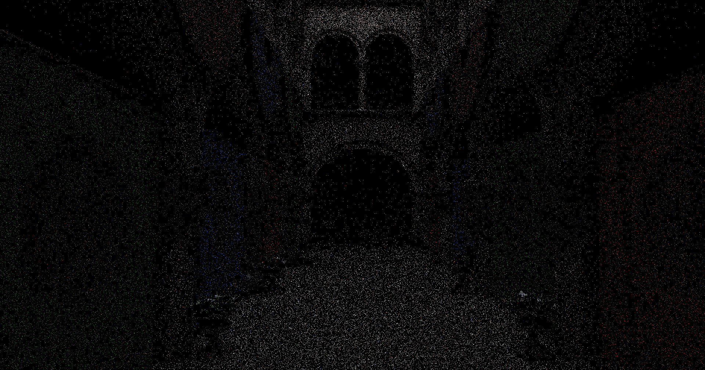 | 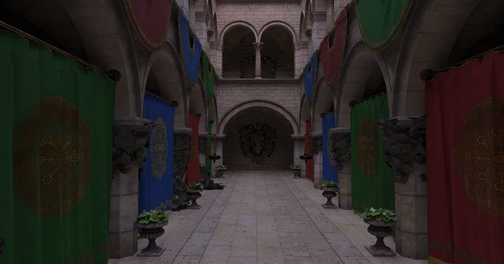 | 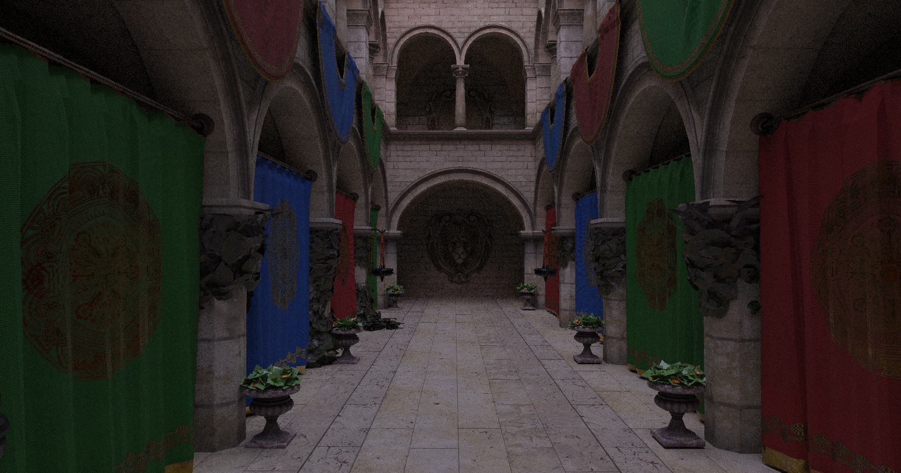 |

| 1 spp input | SVGF | Reference (512 spp) |
|:-:|:-:|:-:|
| 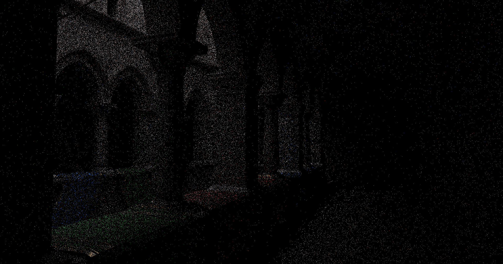 | 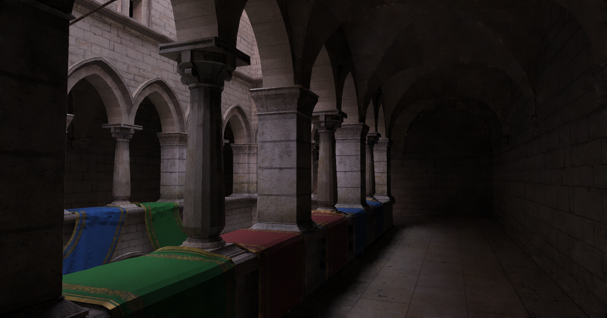 | 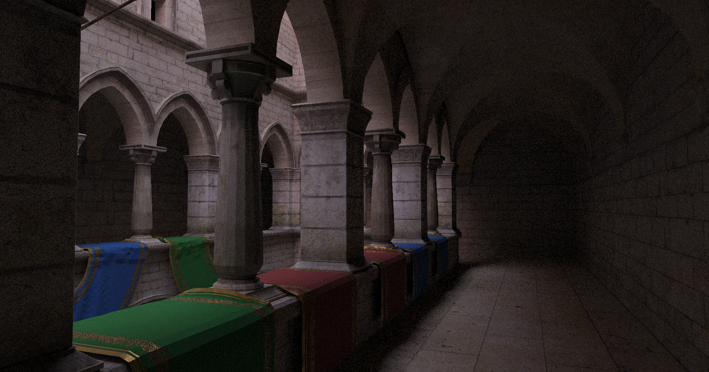 |

| 1 iteration | 3 iterations | 5 iterations |
|:-:|:-:|:-:|
| 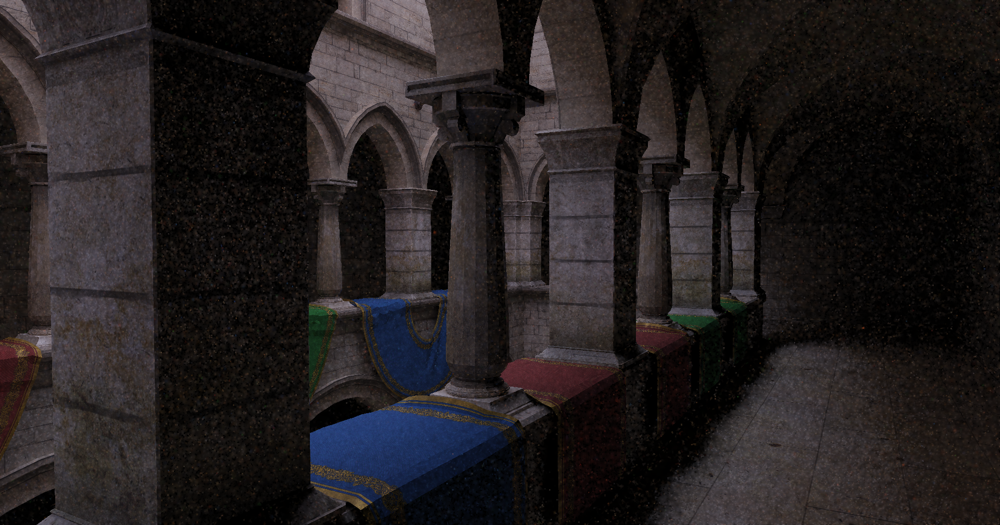 | 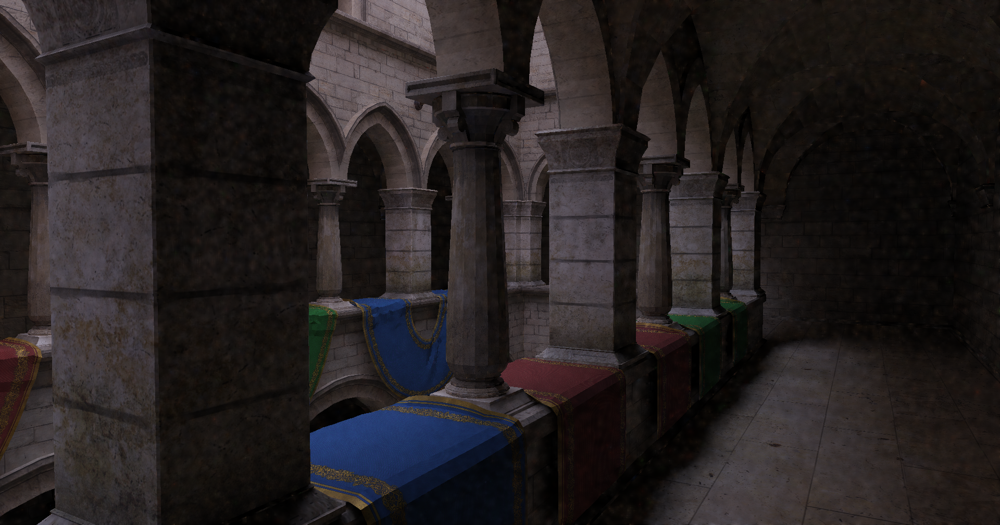 |  |

#### SVGF Analysis

For analysis, I ran the Sponza and Dragon scenes with an HDRI environment map at 1920 x 1080 and captured the frame breakdowns using the following SVGF settings:
- Color Alpha: 0.05
- Moments Alpha: 0.05
- Sigma Luminance: 4
- Sigma Normal: 128
- Sigma Depth: 1
- A-trous Iterations: 5 

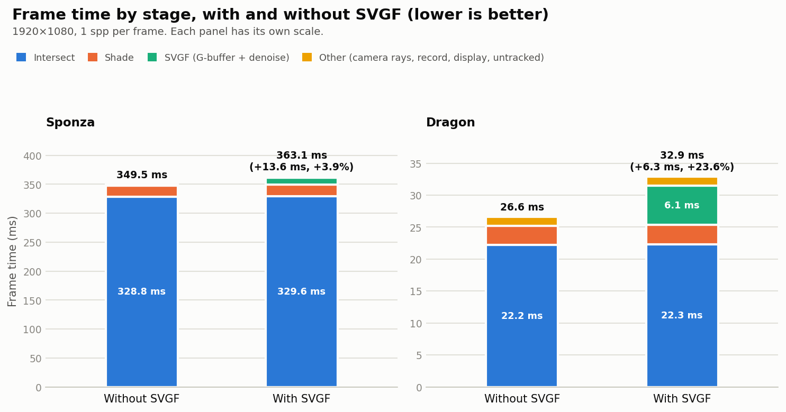

* **Performance:** Notably, SVGF is a roughly constant per-pixel cost on top of an existing path tracer, since it depends on the resolution rather than the scene's geometry. The reason it is a smaller cost in the dragon scene is that more pixels see the environment map, and those pixels take several early outs in the SVGF denoising process. The tradeoff is highly worthwhile in scenes where the output quality is sufficient, as it produces a usable image almost instantly instead of after hundreds of accumulated samples, at the cost of some bias (blurring) compared to the converged reference.

* **GPU vs. CPU:** Every stage is an independent per-pixel image filter, which is ideal for the GPU. A CPU would have to process the roughly 2 million pixels with far fewer threads, and the 5 à-trous iterations per channel alone would be far too slow for real time.

* **Future work:** One feature of the paper I did not implement was adding TAA after SVGF. Another possible performance optimization is using shared memory for the A-trous kernels since there is a lot of overlap between pixels. A third potential improvement is adding motion vectors for moving objects, since I currently only support static objects and a dynamic camera.

* **Downsides:** One of the major downsides is that because this technique uses motion vectors for reprojection, it is not compatible with stochastic antialiasing or physically based depth of field. For this reason, those features are disabled when SVGF is turned on and vice versa. 

### CUDA-Vulkan Interop
I decided when starting out on this project to try out writing the project using Vulkan instead of OpenGL for interop to just get some more practice writing Vulkan code. This is a somewhat simpler setup compared to most Vulkan projects, since it only involves copying the image CUDA renders into the swapchain images and presenting them to the screen. I don't write any shaders myself (ImGui's Vulkan backend uses its own).

The interop-specific allocations happen in Application.cpp's `InitCUDAVulkanInterop` function. In this function, we first create an image to be used for interop, with `ExternalMemoryImageCreateInfo` marking it as shareable so the driver uses a memory layout CUDA can also understand.

Then we need to allocate memory to back the image. The `ExportMemoryAllocateInfo` specifies that the memory can be exported, and the `MemoryAllocateInfo` specifies the size requirement and points to the export allocation info.

Next, GPU allocations are managed by the OS, so we need to get a Win32 handle to the allocation, which is done with `vkGetMemoryWin32HandleKHR`.

The renderer then imports this memory to CUDA whenever the application is resized (including at the start), via `cudaImportExternalMemory`, and maps it as a CUDA array with a surface object that the kernels write to (see `Renderer::resize` in renderer.cpp for details). Each frame, the CUDA work is synchronized with `cudaDeviceSynchronize` before Vulkan copies the image into the swapchain.

* **Performance:** The performance gains from using Vulkan instead of OpenGL in this case are negligible, since we are not actually using Vulkan for heavy operations, just presenting the finished image to the swapchain. The vast majority of the time is dedicated to the path tracing pipeline through CUDA.

* **Future work:** One limitation I have currently is that I only support Windows for the external image handles, but adding Linux support would be good for cross-platform development.

---

## Building

### Requirements
* Windows 10/11 (Linux is not supported due to CUDA-Vulkan interop using Win32 memory handles)
* An NVIDIA GPU with Vulkan support
* [CUDA Toolkit](https://developer.nvidia.com/cuda-downloads) (tested with 13.1)
* [Vulkan SDK](https://vulkan.lunarg.com/) (tested with 1.4.328.1)
* Visual Studio 2022
* CMake 3.24 or newer

### Build Steps
Run the following commands in terminal:
```bash
   cmake -S . -B build
   cmake --build build --config Release
   ```

It loads `scenes/cornell.json` at startup, though the camera is in the floor, so you will need to hold Space to move upwards and see the scene. Otherwise, you can use the scene loader in the ImGui panel to load your own custom scene.

### Controls
* **W / S:** move forward / backward
* **A / D:** move left / right
* **Space / Left Shift:** move up / down
* **Right mouse drag:** look around
* **Scroll wheel:** adjust movement speed

### CMakeLists.txt Changes
The CMakeLists.txt was essentially rewritten from the template project. These are the main modifications:

* **Vulkan:** `find_package(Vulkan)` replaces OpenGL/GLEW, and `VK_USE_PLATFORM_WIN32_KHR` (or `VK_USE_PLATFORM_XLIB_KHR` on Linux, although previously mentioned not supported)

* **External libraries/git submodules:** In `external/`, I use `add_subdirectory` for: GLFW (docs, tests, and examples disabled), GLM, nlohmann/json, and Native File Dialog Extended. I add Dear ImGui's sources and its GLFW and Vulkan backends directly into the executable to be compiled. stb image, tinygltfloader, and tinyobjloader are header-only and added as include directories.

* **Source files:** I use `GLOB_RECURSE` from `src/` for file endings of `.cpp`, `.cu`, `.h`, and `.hpp`. New files are picked up after re-running CMake configure.

* **CUDA settings:**
  * C++17 for both CUDA and C++, with `CMAKE_CUDA_ARCHITECTURES native` to build for the GPU in the machine.
  * `CUDA_SEPARABLE_COMPILATION ON` This allows multiple .cu files to conain cuda kernels.
  * `--expt-relaxed-constexpr` so GLM's `constexpr` functions can be called from device code. This was causing issues with using glm in CUDA kernels otherwise.
  * `--diag-suppress=20012` to hide some GLM warnings which were cluttering the build information.
  * `-Xcompiler=/Zc:preprocessor` This is required by Thrust with CUDA 13.1 and above.
  * `-O3` added in Release, `-G` added in Debug, and also `--generate-line-info` added for NSight profiling to work.

* **Compile definitions:** `GLFW_INCLUDE_VULKAN`, `GLM_FORCE_PURE` (added since glm functions were corrupted when called within CUDA kernels otherwise), and `NOMINMAX` (without this `windows.h` defined `min`/`max` were colliding with glm functions).

* **Scene copying:** copies `scenes/` next to the executable so the default scene is accesible at runtime. This isn't strictly necessary for other scenes though, since they are selected via a file picker.


---

## Bloopers

### Texture UV Disaster
I did not realize the orientation for textures with glTF and OBJ files were different, so I got some horribly textured scenes like the bedroom scene here:

| Blooper | Fixed |
|:-:|:-:|
| 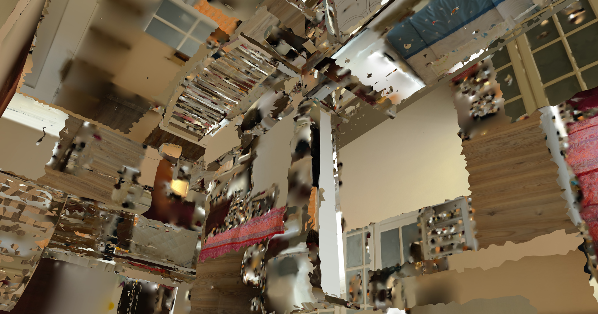 | 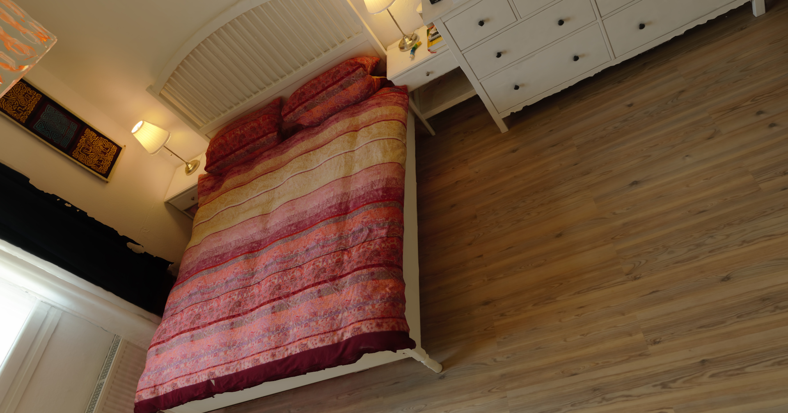 |

**Problem:** OBJ follows the OpenGL convention for textures which means $v = 0$ is the *bottom* of the image. However, glTF puts $v = 0$ at the *top*. I was flipping $v$ for every format, so glTF textures were sampled upside down and for this scene, the texture atlas sampling was totally messed up.

### Incorrectly Signed Refraction Dot Product
At one point, my rough transmission was rendering as opaque instead of see-through, like in the beautiful game scene here:

| Blooper | Fixed |
|:-:|:-:|
| 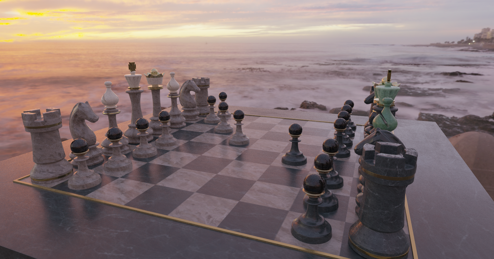 | 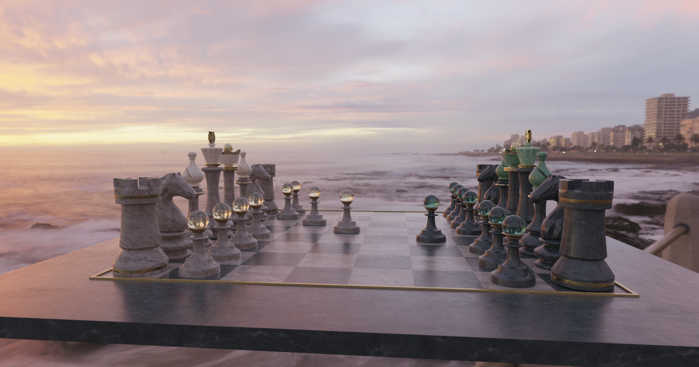 |

**Problem:** When a ray was refracting, the incoming and outgoing directions were on *opposite* sides of the half vector, so my calculation of $\omega_o \cdot \mathbf{h}_t$ was negative. However, some places in the BTDF need that value to be signed and others unsigned, I was using the signed version for everything.

### NaN Values in SVGF
When using SVGF, occasionally a single black pixel would appear, and then slowly spread across the screen, even with the camera standing still:

| Blooper | Fixed |
|:-:|:-:|
| 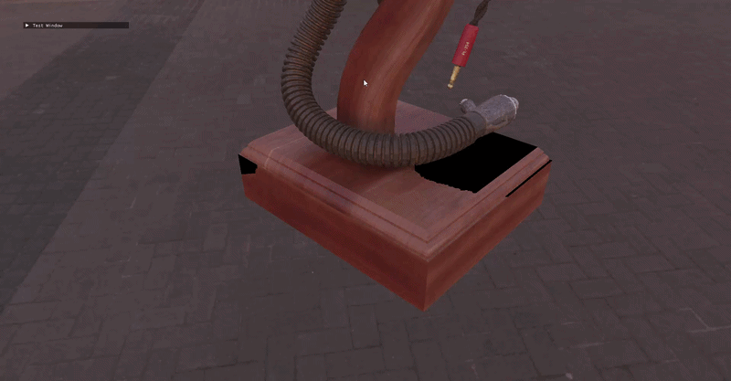 | 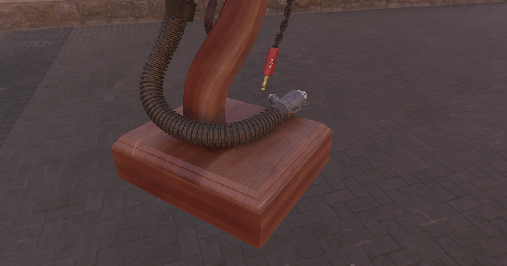 |

**Problem:** Sometimes, a path was generating a NaN or infinite radiance. This wasn't noticable with regular accumlulation since it only affects a single pixel, but with SVGF, it spread across the scene. I fixed this by adding safeguards for non finite values when recording path radiance and checking history for temporal reporjection. 

### SVGF Cross-Geometry Albedo Blur
There was a smearing halo effect of complentary colors when using SVGF at one point:

| Blooper | Fixed |
|:-:|:-:|
| 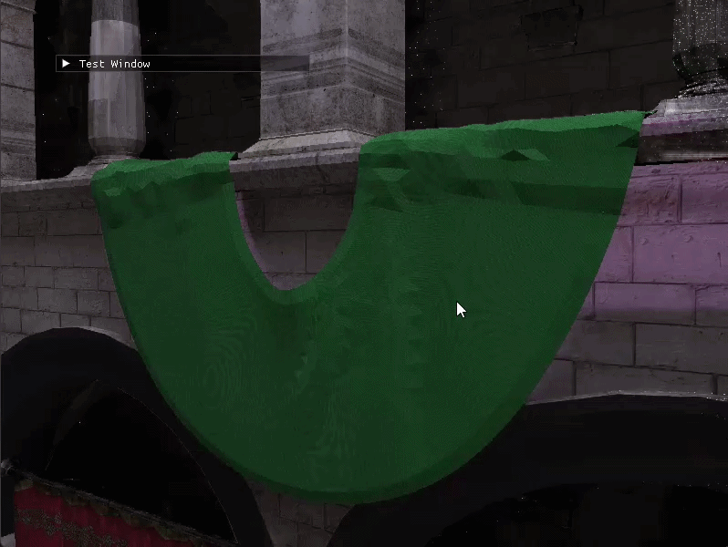 | 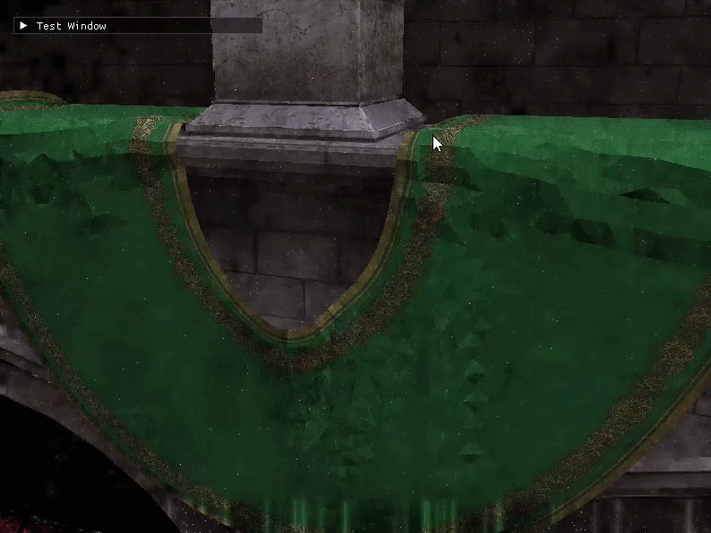 |

**Problem:** In SVGF, the illumination is first divided by albedo and then multiplied back at the end. However at the edges of objects, the temporal ccumulation would sometimes pull from the object behind since the depth and normals were similar. I fixed this by adding a geometry ID buffer so I wouldn't sample from different geometries themselves. This is not a surefire fix if for example the entire scene is a single mesh, but worked in this case for some extra security.

---

## Credits & References

### Third-Party Code
* [tinygltf](https://github.com/syoyo/tinygltf)
* [tinyobjloader](https://github.com/tinyobjloader/tinyobjloader)
* [stb](https://github.com/nothings/stb/tree/master) 
* [Dear ImGui](https://github.com/ocornut/imgui)
* [GLFW](https://www.glfw.org/)
* [GLM](https://github.com/g-truc/glm)
* [nlohmann/json](https://github.com/nlohmann/json) 
* [nativefiledialog-extended](https://github.com/btzy/nativefiledialog-extended), 
* [Vulkan SDK](https://vulkan.lunarg.com/sdk/home) 
* [Thrust](https://developer.nvidia.com/thrust)

### Asset References

* OBJ files from Morgan McGuire, Computer Graphics Archive, July 2017 (https://casual-effects.com/data)

  * **Bedroom**, © 2017 fhernand, [CC BY-SA 4.0](https://creativecommons.org/licenses/by-sa/4.0/). Photogrammetry scan created with RealityCapture, materials adjusted for OBJ by Morgan McGuire. Originally published on [Sketchfab](https://sketchfab.com/3d-models/bedroom-869e6ec859a84240b9a099ae829f47fa).
  * **Cornell Box**, © 2009 Morgan McGuire, [CC BY 3.0](https://creativecommons.org/licenses/by/3.0/). OBJ versions created by Guedis Cardenas, Morgan McGuire, and Michael Mara, based on the original Cornell Box by Donald Greenberg and students at Cornell University.
  * **Crytek Sponza**, © 2010 Frank Meinl, Crytek, [CC BY 3.0](https://creativecommons.org/licenses/by/3.0/). Remodeled from Marko Dabrovic's original Sponza.
  * **Chinese Dragon**, © 1996 Stanford University, from the [Stanford 3D Scanning Repository](https://graphics.stanford.edu/data/3Dscanrep/) (Stanford Scan license).
  * **Living Room** ("The White Room Cycles"), © 2012 Jay, [CC BY 3.0](https://creativecommons.org/licenses/by/3.0/). Converted for rendering research by Benedikt Bitterli, converted to OBJ by Nicholas Hull (NVIDIA), with materials corrected by Morgan McGuire.
  * **San Miguel 2.0**, © Guillermo M. Leal Llaguno (Evolución Visual), [CC BY 3.0](https://creativecommons.org/licenses/by/3.0/). 2017 version improved by Morgan McGuire, Guedis Cardenas, Michael Mara, and Nicholas Hull.

* glTF Files from the Khronos Group's [glTF-Sample-Models](https://github.com/KhronosGroupArchives/glTF-Sample-Models)

  * **A Beautiful Game**, Academy Software Foundation, MaterialX Project, with additional glTF conversion by Ed Mackey (AGI), [CC BY 4.0](https://creativecommons.org/licenses/by/4.0/). Original model by Moeen Sayed and Mujtaba Sayed for a SideFX Karma tutorial.
  * **Damaged Helmet**, "Battle Damaged Sci-fi Helmet - PBR" by [theblueturtle_](https://sketchfab.com/theblueturtle_), [CC BY-NC](https://creativecommons.org/licenses/by-nc/4.0/). [Original on Sketchfab](https://sketchfab.com/models/b81008d513954189a063ff901f7abfe4).
  * **Flight Helmet**, donated by Microsoft for glTF testing, [CC0](https://creativecommons.org/publicdomain/zero/1.0/).
  * **Sponza**, Crytek Sponza by Frank Meinl (Crytek), based on the original by Marko Dabrovic, with PBR textures by [Alexandre Pestana](http://www.alexandre-pestana.com/pbr-textures-sponza/) and fixes by Morgan McGuire.
  * **Suzanne**, Blender's test monkey, donated by Norbert Nopper for glTF testing.
  * **Toy Car**, initial model by Guido Odendahl, extensions and scene composition by Eric Chadwick, [CC0](https://creativecommons.org/publicdomain/zero/1.0/).

* HDRI environment maps from [Poly Haven](https://polyhaven.com/hdris), all [CC0](https://creativecommons.org/publicdomain/zero/1.0/):

  * [Lakeside Night](https://polyhaven.com/a/lakeside_night), photography by Greg Zaal, processing by Jarod Guest
  * [Venice Sunset](https://polyhaven.com/a/venice_sunset), by Greg Zaal
  * [Penguin Museum](https://polyhaven.com/a/penguin_museum), by Jenelle van Heerden
  * [Blue Lagoon Night](https://polyhaven.com/a/blue_lagoon_night), by Greg Zaal
  * [The Sky Is On Fire](https://polyhaven.com/a/the_sky_is_on_fire), by Greg Zaal, backplates by Rico Cilliers
  * [Belfast Sunset (Pure Sky)](https://polyhaven.com/a/belfast_sunset_puresky), photography by Dimitrios Savva, processing by Greg Zaal, sky edits by Jarod Guest
  * [Ferndale Studio 04](https://polyhaven.com/a/ferndale_studio_04), photography by Dimitrios Savva, processing by Jarod Guest

### Implementation References
* M. Pharr, W. Jakob, G. Humphreys. *Physically Based Rendering: From Theory to Implementation*, 4th ed. [link](https://www.pbr-book.org/)

* R. Cook, K. Torrance. *A Reflectance Model for Computer Graphics*. ACM Transactions on Graphics, 1982. https://doi.org/10.1145/357290.357293

* James F. Blinn. 1977. Models of light reflection for computer synthesized pictures. SIGGRAPH Comput. Graph. 11, 2 (Summer 1977), 192–198. https://doi.org/10.1145/965141.563893

* C. Schlick. *An Inexpensive BRDF Model for Physically-based Rendering*. Computer Graphics Forum, 13(3):233–246, 1994. https://doi.org/10.1111/1467-8659.1330233

* B. Walter, S. R. Marschner, H. Li, K. E. Torrance. *Microfacet Models for Refraction through Rough Surfaces*. Proceedings of the 18th Eurographics Conference on Rendering Techniques (EGSR '07), pp. 195–206, 2007. https://dl.acm.org/doi/10.5555/2383847.2383874

* The Khronos Group. *glTF 2.0 Specification*. [link](https://registry.khronos.org/glTF/specs/2.0/glTF-2.0.html)

* E. Veach, L. J. Guibas. *Optimally Combining Sampling Techniques for Monte Carlo Rendering*. Proceedings of the 22nd Annual Conference on Computer Graphics and Interactive Techniques (SIGGRAPH '95), pp. 419–428, 1995. https://doi.org/10.1145/218380.218498

* C. Schied, A. Kaplanyan, C. Wyman, et al. *Spatiotemporal Variance-Guided Filtering: Real-Time Reconstruction for Path-Traced Global Illumination*. Proceedings of High Performance Graphics (HPG '17), Article 2, 2017. https://doi.org/10.1145/3105762.3105770

* The Khronos Group. *Vulkan Tutorial*. [link](https://docs.vulkan.org/tutorial/latest/00_Introduction.html)

* NVIDIA. *CUDA Programming Guide*, [link](https://docs.nvidia.com/cuda/cuda-programming-guide/04-special-topics/graphics-interop.html)